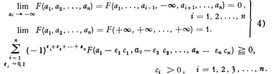

# 概率理论基础

## 无限概率域

### 连续性公理

按照惯例，我们用符号 $\underset{m}{\mathscr{D}} A_m$ 表示集合 $A_m$ 的乘积（无论是有限个还是无限个），用符号 $\underset{m}{\mathscr{G}} A_m$ 表示集合 $A_m$ 的和。仅当集合 $A_m$ 为不相交集（disjont sets，集互斥集合），集合的和的形式记为 $\sum\limits _m A_m$。由此可得：
$$
\underset{m}{\mathscr{G}} A_m = A_1 \dot{+} + A_2 \dot{+} \dots \\
\sum\limits _m A_m = A_1 + A_2 + \dots \\
 \underset{m}{\mathscr{D}} A_m = A_1 A_2 \dots
$$
在后续的研究中，除了公理 I-V 外，我们认为以下公理也成立：

**公理 VI**：对于集合  $\mathcal{E}$ 中的一个递减的事件序列
$$
\tag{1}
A_1 \supset A_2 \supset \dots \supset A_n \supset \dots
$$

$$
\tag{2}
\underset{n}{\mathscr{D}} A_n = 0
$$

当公式 $(2)$ 成立时，以下等式（公式 $(3)$）成立。
$$
\tag{3}
\lim \limits_{n \rightarrow \infin} P(A_n) = 0
$$
在后续的研究中，我们将满足第一章第1节中五个公理，以及本章开头提到的公理 VI 的**集合系统**及其对应的$P(A)$，称为概率域。而第一章中原本定义的概率域称为广义概率域（generalized fields of probability）。

如果集合系统 $\mathcal{E}$ 是有限的，公理 VI 可以由公理 I-V 推导得出。事实上，这种情况下在序列 ($1$) 中仅存在有限个不同的集合。假设 $A_k$ 是该序列中最小的（集合的大小指集合的**基数**），则所有与 $A_k$ 恰巧（基数）相等的集合 $A_{p + k}$，有以下关系：
$$
A_k = A_{k + p} = \underset{n}{\mathscr{D}} A_n = 0 \\
\lim P(A_n) = P(0) = 0
$$
因此，第一章中提到的所有有限概率域的例子都满足公理 VI。已证明，公理系统 I-VI 是一致且不完备的（consitent and incomplete）。

然而，对于无限概率域，连续性公理（公理VI）已被证明是独立于公理 I-V 的。因为这一新的公理仅对于无限概率域是必要的，所以几乎无法像第一章第 2 节那样中，对公理 I-V 那样，解释清楚公理 VI 的经验意义（empirical meaning）。因为在描述任何可观测的随机过程时，我们只能得到有限概率域。无限概率域只出现在现实中的随机过程的理想化模型中。后续的讨论，我们仅限于满足公理 VI 的模型。这一限制（尽管有些随意）在研究绝大多数的模型时有效且可行的。

**广义加法定理**：如果 $A_1, A_2, ..., A_n, ...$ 以及 $A$ 属于 $\mathcal{E}$，则由公式$(4)$
$$
\tag{4}
A = \sum_n A_n
$$
可得公式$(5)$
$$
\tag{5}
P(A) = \sum_n P(A_n)
$$
证明：令
$$
R_n = \sum _{m > n} A_m
$$
则显然
$$
\underset{n}{\mathscr{D}} (R_n) = 0
$$
因此根据公理 VI 得
$$
\tag{6}
\lim P(R_n) = 0 \qquad n \rightarrow \infin
$$
另一方面，根据加法定理得
$$
\tag{7}
P(A) = P(A_1) + P(A_2) + \dots + P(A_n) + P(R_n)
$$
由公式 (6) 和公式 (7) 可得公式 (5)。

由此已表明，概率 $P(A)$ 是一个集合系统 $\mathcal{E}$ 上的完全可加集函数。公理 V 和 VI 对于定义在任意 $\mathcal{E}$ 上的完全可加集函数都成立[^*]。因此可以通过以下方式定义概率域的概念：

>   令 $E$ 为任意集合，$\mathcal{E}$ 为 $E$ 的包括其本身在内的子集组成的域，以及 $P(A)$ 为一个定义在 $\mathcal{E}$ 上的非负的完全可加集函数。则 $\mathcal{E}$ 与集合函数 $P(A)$ 共同构成一个概率域。

**收敛性定理**：如果 $A_1, A_2, ..., A_n, ...$ 以及 $A$ 属于 $\mathcal{E}$，并且
$$
\tag{8}
A \subset \underset{n}{\mathscr{G}} A_n
$$
则
$$
\tag{9}
P(A) \leq \sum_n P(A_n)
$$
证明：
$$
A = A \underset{n}{\mathscr{G}} A_n = A (A_1 + A_2(1 - A_1) + A_3(1 - A_2 - A_1)) + \dots = A A_1 + A (A_2 - A_2 A_1) + A (A_3 - A_3 A_2 - A_3 A_1) + \dots \\
P(A) = P(A A_1) + P(A (A_2 - A_2 A_1)) + \dots \leq P(A_1) + P(A_2) + \dots
$$

### 概率的波莱尔（Borel）域

对于 $\mathcal{E}$ 中的集合 $A_n$，如果集合 $A_n$ 的可数和 $\sum _n A_n$ 也属于 $\mathcal{E}$，则称 $\mathcal{E}$ 为一个波莱尔域。波莱尔域也称为**完全可加的集合系统**（completely additive systems of sets）。由以下等式
$$
\tag{1}
\underset{n}{\mathscr{G}} A_n = A_1 + (A_2 - A_2 A_1) + (A_3 - A_3 A_2 - A_3 A_1) + \dots
$$
可推断出，波莱尔域包含了所有的 $\underset{n}{\mathscr{G}} A_n$，后者由波莱尔域中的可数个集合 $A_n$ 组成。

由以下等式
$$
\tag{2}
\underset{n}{\mathscr{D}} A_n = E - \underset{n}{\mathscr{G}} A_n
$$
可知，对于集合 $A_n$ 的乘积 $\underset{n}{\mathscr{D}} A_n$ 也有相同的结论。

当域 $\mathcal{E}$ 为波莱尔域时，对应的概率域称为波莱尔概率域。只有在波莱尔概率域下，我们才可以自由地研究概率，而不用担心**没有概率的事件**。接下来我们将从**扩展定理**开始证明，后续讨论都将在波莱尔概率域中进行。

给定一个概率域 $(\mathcal{E}, P)$，可知[^2.1] 存在一个包含域 $\mathcal{E}$ 的最小波莱尔域 $B\mathcal{E}$，我们有以下扩展定理：

**扩展定理**：总是可以将定义在域 $\mathcal{E}$ 上的非负完全可加集函数 $P(A)$ 扩展到所有的最小波莱尔域 $B\mathcal{E}$，且不丢失它的任何性质（非负性、完全可加性）。且只有一种方式可以做到。

扩展域 $B\mathcal{E}$ 与扩展后的集合函数 $P(A)$ 一起构成了概率域 $(B\mathcal{E}, P)$。这个概率域称为域 $(\mathcal{E}, P)$ 的波莱尔扩展。

这个定理的证明属于可加集函数理论的范畴，并且有时以其他的形式出现。此处给出一种形式的证明：

令 $A$ 为集合 $E$ 的任一子集，用 $P^*(A)$表示以下和式的下限
$$
\sum_n P(A_n)
$$
对于集合 $A$ 的所有由有限个或可数多个 $\mathcal{E}$ 中的集合 $A_n$ 构成的覆盖的覆盖（coverings）：
$$
A \subset \underset{n}{\mathscr{G}} A_n
$$
很容易证明，$P^*(A)$ 是 Carathéodory 外测度[^2.2]。根据收敛定理（本章第一节），对于所有 $\mathcal{E}$ 中的集合，$P^*(A)$ 恰巧等于 $P(A)$。进一步可以证明，所有 $\mathcal{E}$ 中的集合在 Carathéodory 测度下都是可测的。因为所有的可测集构成了波莱尔域，所以域 $B\mathcal{E}$ 中的集合也是可测的。因此集合函数 $P^*(A)$ 在 $B\mathcal{E}$ 上是完全可加的。在域 $B\mathcal{E}$ 上，我们令
$$
P(A) = P^*(A)
$$
由此我们证明了扩展域的存在。扩展域的唯一性来源于域 $B\mathcal{E}$ 是最小波莱尔域。

**评论**：即使域 $\mathcal{E}$ 中的集合（事件）$A$ 是真是存在的、可观测的事件，但这并不意味着扩展域中的集合也是真实存在的、可观测的。

因此存在这样的可能性：当概率域 $(\mathcal{E}, P)$ 可以视为现实中的随机事件的镜像时，扩展概率域 $(B\mathcal{E}, P)$ 仍然只具有数学上的结构，而没有现实的概率意义。

因此域 $(B\mathcal{E}, P)$ 中的集合通常只是理想事件，它们并没有在现实世界中对应的对象。然而，如果利用这些理想事件的概率进行的推演，能够让我们得出现实世界中的随机事件的概率，那么从经验的角度来看，这并不矛盾【利用只在数学概念中存在的概率，计算出现实世界中事件的概率】。

### 无限概率域举例

I. 在本章第 1 节中，我们构造了很多有限概率域。现在假定 $E = {\xi_1, \xi_2, \dots, \xi_n, \dots }$ 为一个可数集合，并令 $\mathcal{E}$ 为 $E$ 的所有子集的集合。基于 $\mathcal{E}$，所有可能的概率域可以按如下方式得出：

给定一个非负实数序列 $p_n$：
$$
p_1 + p_2 + \dots + p_n + \dots = 1
$$
且对于每个集合 $A$，定义
$$
P(A) = \sum_n ' p_n
$$
其中求和符号 $\sum '$ 作用于所有的属于 $A$ 的 $\xi_n$ 的下标。这些概率域显然是波莱尔域。

II. 在这个例子中，我们应当假设 $E$ 代表实数轴。首先假设 $\mathcal{E}$ 由所有可能的半开区间 $[a_i; b) = \{a \le \xi < b\}$ [^#] 的有限和组成（不仅仅只考虑由有限实数 $a$ 和 $b$ 构成的常规区间，也考虑如 $[-\infin; a), [a; +\infin), [-\infin; +\infin)$ 这类的非常规区间）。这样，$\mathcal{E}$ 即为一个域。然而，根据扩展定理，任何定义在 $\mathcal{E}$ 上的概率域都可扩展为一个定义在 $B\mathcal{E}$ 上的类似的域。因此在这种情况下，集合系统 $B\mathcal{E}$ 实际上无非是实数轴上所有波莱尔点集的系统。接下来考虑下面的情况。

III. 同样假设 $E$ 为实数轴，$\mathcal{E}$ 由这条轴上的所有波莱尔点集构成。想要构造给定域 $\mathcal{E}$ 上的概率域，只需在 $\mathcal{E}$ 上定义一个任意的非负的完全可加集函数 $P(A)$，且满足 $P(E) = 1$。已知这样的函数由其在区间 $[-\infin; x)$ 上的取值唯一确定[^2.3]：
$$
\tag{1}
P[-\infin;x) = F(x)
$$
函数 $F(x)$ 称为 $\xi$ 的分布函数。之后在第三章第 2 节我们可以证明 $F(x)$ 是左连续的非减函数，且具有以下的极限值：
$$
\tag{2}
\lim_{x \rightarrow -\infin} F(x) = F(-\infin) = 0, \\
\lim_{x \rightarrow +\infin} F(x) = F(+\infin) = 1
$$
反过来，如果一个函数 $F(x)$ 满足这些条件，则它总是可以确定一个非负的完全可加集函数 $P(A)$，使得 $P(E) = 1$ [^2.4]。

IV. 现在假设基本集合 $E$ 为一个 $n$ 维欧几里得空间 $R^n$，即集合中的每个元素 $\xi$ 是一个由实数构成的含有 $n$ 个元素的有序元组（tuples）：$\xi = \{ x_1, x_2, \dots, x_n \}$。假设 $\mathcal{E}$  由欧几里得空间 $R^n$ 中所有的波莱尔点集[^2.5]组成。根据与示例 II 中使用的类似推理，我们不需要研究更狭义的集合系统，例如 n 维区间的系统。概率函数 $P(A)$ 同样应该是一个定义在 $\mathcal{E}$ 上的非负的完全可加集函数，且满足 $P(E) = 1$。这样的集合函数的取值由特定集合 $L_{a_1, a_2, \dots, a_n}$ 确定：
$$
\tag{3}
P(L_{a_1, a_2, \dots, a_n}) = F(a_1, a_2, \dots, a_n)
$$
其中 $L_{a_1, a_2, \dots, a_n}$ 表示所有满足 $x_i < a_i (i = 1, 2, \dots, n)$ 的 $\xi$ 的集合。

对于 $F(a_1, a_2, \dots, a_n)$ ，我们选择的函数需要满足对于每一个变量都是左连续的非减函数，且满足以下条件：
$$
\tag{4}
\lim_{a_i \rightarrow -\infin} F(a_1, a_2, \dots, a_n) = F(a_1, \dots, a_{i - 1}, -\infin, a_{i + 1}, \dots, a_n) = 0, \\
(i = 1, 2, ..., n) \\
\lim_{a_1 \rightarrow +\infin, a_2 \rightarrow +\infin, \dots, a_n \rightarrow +\infin} F(x) = F(+\infin, +\infin, \dots, +\infin) = 1
$$

>注意以上公式中。$F(x) = 0$ 的极限，只需有其中一个 $a_i$ 趋近于负无穷即可；$F(x) = 1$ 的极限,需要所有的 $a_i$ 都趋近于正无穷。

【注】参考的两个版本在公式 $(4)$ 上有出入，这里贴了一个我能看得懂的，下面图中是另一个版本的我看不懂的公式：

$F(a_1, a_2, \dots, a_n)$ 称为变量 $x_1, x_2, \dots, x_n$ 的分布函数。

对上述类型的概率域的研究足以解决概率理论中的所有经典问题[^2.6]。特别地，$R^n$ 上的概率函数可以定义为：

定义在 $R^n$ 上的任意非负点函数：
$$
\int^{+\infin}_{-\infin} \int^{+\infin}_{-\infin} \dots \int^{+\infin}_{-\infin} f(x_1, x_2, \dots, x_n) dx_1 dx_2 \dots dx_n = 1
$$
并且令
$$
\tag{5}
P(A) = \int \int \dots \int_{A} f(x_1, x_2, \dots, x_n) dx_1 dx_2 \dots dx_n
$$
$f(x_1, x_2, \dots, x_n)$ 此时称为在点 $(x_1, x_2, \dots, x_n)$ 处的概率密度（参考第三章第 2 节）。

另一类 $R^n$ 上的概率函数可以由以下方式得出：假设 ${\xi_i}$ 为 $R^n$ 上的一个点的序列，令 $p_i$ 为一个非负实数的序列，使得 $\sum P_i = 1$。此时如例子 I 中那样，令
$$
P(A) = \sum' p_i
$$
其中求和符号 $\sum'$ 作用于所有属于 $A$ 的 $\xi$ 的下标。

以上提到的两种定义在 $R^n$ 上的概率函数并没有涵盖所有可能的情况，但是通常认为这两种定义对于概率理论的应用已经足够。然而，我们可以设想一些在经典范围之外的应用问题，其中基本事件通过无限多个坐标来定义。我们将在引入为此目的所需的若干概念后，进一步详细研究相应的概率场（参考第三章第 3 节）。

[^*]: See, for example, O. NIKODYM, Sur une généralisation des intégrales de M. J. Radon, Fund. Math. v. 15, 1930, p. 136.
[^2.1]: 参考 HAUSDORFF, Mengenlehre, 1927, p. 85.
[^2.2]: CARATHÉODORY, Vorlesungen über reelle Funktionen, pp.237-258. (New York, Chelsea Publishing Company).
[^#]: 此处原文，区间表示方式，中间为`;`。
[^2.3]: Cf., for example, LEBESGUE, Leçons sur l’intégration, 1928, p. 152-156.
[^2.4]: 参考前一个注释中的内容。
[^2.5]: For a definition of Borel sets in R see HAUSDORFF, Mengenlehre, 1927, pp. 177-181.
[^2.6]: Cf., for example, R. v. MISES [1], pp. 13-19. Here the existence of probabilities for “all practically possible:” sets of an n-dimensional space is required.

