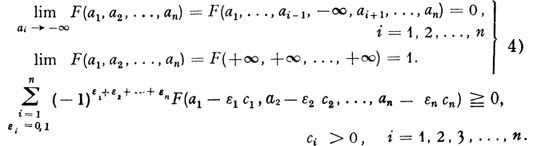

# 概率理论基础

根据英文第二版翻译。

作者：Andrey Nikolaevich Kolmogorov

英文版本译者：Nathan Morrison

作者小传：A.T. Bharucha-Reid

ISBN：9780486821597

[TOC]

## 编者注

在准备Kolmogorov（柯尔莫戈洛夫）教授这项基础工作的英文翻译稿的过程中，我们参考了1933年发表在《Ergebnisse Der Mathematik》上的德文原版专题论文**Grundbegriffe der Wahrscheinlichkeitrechnung**（概率论的基本概念），以及1936年出版的俄文译本（由G. M. Bavli翻译）。

编者感谢他两位朋友和他侄女的帮助。

编者感谢 Roy Kuebler 提供的自己由德文翻译的英文版本。

## 前言

本专题论文的目的在于，给概率理论以公理化的基础。作者给自己设定的任务是，将概率论的基本概念（直到最近[^0.1]这些概念还被认为是相当奇怪的概念）置于现代数学的一般概念之中。

如果不先介绍 Lebesgue（勒贝格）关于测度和积分的理论，以上任务几乎是无法完成的。在 Lebesgue 发表他的研究成果之后，集合的度量与事件的概率之间的联系，以及函数的积分与随机变量的数学期望之间的联系，变得显而易见。这些联系为进一步的推广提供了可能，例如，独立随机变量的各种性质被看作与正交函数的相应性质完全类似。但如果要将概率论置于以上的可类比的联系的基础之上，仍然有必要使度量和积分理论独立于勒贝格所突出的几何元素。这项工作由 Fréchet 完成[^2]。

虽然基于上述一般观点的概率论理论在某些数学家中已经存在了一段时间，但缺乏一部完整的、不依赖外部复杂概念的系统性阐述。（参考文献中的 Fréchet 的著作 [^0.2]，给出了一个比较完整的论述。）

我想请大家注意那些超出了专家们早已熟知的以上提到的内容，包括：

1.   有限维空间中的概率分布（第三章，第 4 节）；
2.   对某个参数的数学期望的微分和积分（第四章，第 5 节）；
3.   条件概率和条件期望（第五章）；

这些新问题是随着一些完全具体的物理问题产生的[^0.3]。

第六章包含了对 A. Khinchine 和作者关于普通和强大数定律适用性限制的一些结果的概述，但没有提供证明。参考文献中列举了一些近期的作品。

作者对 Khinchine 的致谢，后者通读全文后给予了一些改进建议。

Kljasma near Moscow

1933年复活节

[^0.1]: 原始德文版本发表于1933年。
[^0.2]: 暂不确定此人是谁。
[^0.3]: 原文脚注1，Zur Statistik der kontinuierlichen Systeme und des zeitlichen Verlaufes der physikalischen Vorgange. Phys. Jour, of the USSR, Vol. 3, 1933, pp. 35-63. 标题英文为 *On the statistics of continuous systems and the temporal evolution of physical processes*.

## 初等概率论

初等概率理论，定义为：

>   研究有限个（随机）事件的概率的理论。

当然，在加入一些必要的新原则之后，这一理论也可用于研究无限个随机变量的问题。第二章将会介绍研究无限个随机变量概率的数学理论时用到的一个公理（公理六）。

作为一门数学分支的概率理论，可以，并且应该像几何和代数一样由一些基本公理构建起来。这意味着，在我们定义好研究的基本要素和它们的基本关系，并且定义好规定这些关系的公理之后，所有进一步的阐述都必须完全基于这些公理，而与这些基本要素及其关系的具体的现实含义无关。

在第一节中，概率域（field of probabilities）定义为满足一些特定条件的集合系统。在纯数学角度发展概率理论的过程中，集合中元素的具体含义是什么，一点都不重要（参考希尔伯特（Hilbert）的 *Foundations of Geometry* 一书中对于基本几何概念的介绍，或者抽象代数中对于群、环和域的定义）。

众所周知，每一个公理化（抽象）理论，除了直接产生它的现实世界的物理域景，都还可以有无数个现实世界中的其他的物理域景（应用）。因此，我们发现了概率论在科学领域中的一些应用，这些应用与**随机事件**和**概率**这两个词的严格含义没有关系。

根据选择的公理不同，以及基本概念和概念之间关联的不同，概率理论的公设基础可以采用不同的方式构建。但如果我们的目标是在公理系统和概率理论未来发展这两方面都达到最大程度的简洁，那么**随机变量**及**概率**这两个基本公设性质的概念似乎是最佳的选择。概率论也有其他的公设系统，尤其在一些公设系统中，**概率**并不被当作基本概念，而是在其他概念的基础上得出的[^1.1]。构建这类公设系统的目的是把数学理论与概率理论的经验发展（empirical development）尽可能紧密地结合起来。

>   empirical 用来描述基于观察、实验或经验得出的事实或结论。它强调了通过实证研究或实践经验获得的知识，而不是仅仅依靠理论推导或逻辑推理。在科学、社会科学和哲学等领域中，“empirical”通常指的是基于实际观察和实验的数据或现象，以区别于理论或假设。

### 公理 [^1.2]

假设 $E$ 是一组元素 $\xi$, $\eta$, $\zeta$, ... 的集合，集合中的元素称为**基本事件**（elementary events）。$\mathcal{E}$ 是集合 $E$ 的子集的集合，那么集合 $\mathcal{E}$​​ 中的元素称为**随机变量**（random events）。

**公理**

I. $\mathcal{E}$​ 是一个集合的域（a field of sets）；

II. $\mathcal{E}$ 包含集合 $E$ [^1.3]​；

III. 对于集合 $\mathcal{E}$ 中的任意一个集合 $A$，赋予它一个非负实数 $\mathrm{P}(A)$。这个实数 $\mathrm{P}(A)$ 称为事件 $A$ 的概率。

IV. $\mathrm{P}(E) = 1$。

V. 如果集合 $A$ 和集合 $B$ 没有公共的元素，则
$$
\mathrm{P}(A + B) = \mathrm{P}(A) + \mathrm{P}(B)
$$
一个集合系统 $\mathcal{E}$，加上确定的作为概率的实数 $\mathrm{P}(A)$​​，当它们满足公理 1-5 时，就称为一个**概率域**（a field of probability）。

由下面的例子可以证明，公理系统I-V是一致的（consistent）。假设集合$E$ 包含一个元素 $\xi$，且集合 $\mathcal{E}$ 包括集合 $E$ 和空集 $\empty$，则：
$$
\mathrm{P}(E) = 1 \\
\mathrm{P}(\empty) = 0
$$
但是以上公理系统是不完备的（complete），因为在概率理论的各种问题中，需要考虑不同的概率域。

**构造概率域**

按以下方式构造一个最简单的概率域：

给定任意一个有限集合$E = \{\xi_1, \xi_2, ..., \xi_k \}$，以及任意一个非负实数的集合 $\{p_1, p_2, ..., p_k\}$，后者满足约束$p_1 + p_2 + ... + p_k = 1$。$\mathcal{E}$ 为所有集合 $E$ 的子集组成的集合，则有：
$$
\mathrm{P}\{\xi_{i1}, \xi_{i2}, ..., \xi_{i \lambda}\} = p_{i1} + p_{i2} + \dots + p_{i \lambda}
$$
以上公式中，$p_1, p_2,..., p_k$ 称为基本事件 $\xi_1, \xi_2, ..., \xi_k$ 的概率，或简称为基本概率（elementary probabilities）。用这种方式，可以推导出所有可能的有限概率域。在这个概率域中， $\mathcal{E}$ 由所有集合 $E$ 的子集组成。当集合 $E$ 为有限集合时，这样产生的概率域称为是有限的。关于概率域更多的例子，参考第二章第三节。

### 与实验数据的关系[^1.4]

我们用以下的方式把概率理论应用于现实世界：

1.   假设有一个条件复合体（a complex of conditions） $\mathcal{E}$，其中的条件全部确定时，我们称为一次实现；这里允许发生多次实现，即允许这个条件复合体中的条件重复实现多次（可能出现不同结果）。

2.   我们研究一组明确定义的事件，每当条件 $\mathcal{E}$ 中的条件确定时，这一组事件就会发生。对于每一组（或许是不同）的确定条件，不同的事件发生。假设 $E$ 是所有给定的事件变量（给每一个事件赋予一个变量） $\xi_1, \xi_2, ...$ 的集合，集合中的一些变量可能永远也不会发生。我们利用先验知识，尽可能多地在集合 $E$ 中包含可能的变量。

3.   如果在条件实现时所发生的事件变量属于集合 $A$（以任何方式定义），那么我们称事件 $A$​ 已经发生。

     例子：假设条件复合体 $\mathcal{E}$ 是扔一枚硬币 2 次，则第 2 段提到的事件集合包括每次抛硬币时可能出现正面或反面的情况。由此得出，只可能有 4 种事件变量（随机事件），分别为：正正、正反、反正、反反。如果事件 $A$ 表示**重复结果发生**，则它包括正正和反反两种基本事件。这样，**每一个事件都可以视为随机事件的集合**。

4.   在某些条件下（这里不会讨论），我们可以假设对于在条件 $\mathcal{E}$  下可能发生或可能不发生的事件 $A$，给它分配一个实数 $\mathrm{P}(A)$，这个实数具有以下特征：

     a）可以确定，当条件复合体 $\mathcal{E}$ 中的条件重复足够多次数 $n$ 时，如果 $m$ 表示事件$A$ 发生的次数，则 $m/n$ 与 $\mathrm{P}(A)$ 的差别会非常小。

     b）如果 $\mathrm{P}(A)$ 很小，则几乎可以确定，当条件只重复一次时事件 $A$ 不会发生。

**从经验角度推导公理**

一般来说，我们会假设观测到的事件 $A, B, C, ...$组成的系统 $\mathcal{E}$ 构成一个域，其中每个事件都被赋予了一个确定的概率。这个事件系统 $\mathcal{E}$ 包含了集合 $E$ （公理 I, II，以及公理 III 的第一部分，假定概率的存在）。很显然 $0 \le m/n \le 1$，因此自然推导出公理 III 的第二部分。对于事件 $E$，$m$ 总是等于 $n$，因此自然推导出 $\mathrm{P}(E) = 1 $（公理 IV）。最后，如果集合 $A$ 与集合 $B$ 没有重叠（不兼容），则：
$$
m = m_1 + m_2
$$
其中 $m_1$，$m_2$ 分别表示事件 $A$，$B$ 发生的次数。由此：
$$
\frac{m}{n} = \frac{m_1}{n} + \frac{m_2}{n}
$$
因此可以推出$\mathrm{P}(A+B) = \mathrm{P}(A) + \mathrm{P}(B)$ （公理 V）。

**备注 1**

如果两个独立的陈述各自都是实际可靠的，那么我们可以说它们同时都是可靠的，尽管可靠程度在这个过程中稍微降低了。然而，如果这样的陈述的数量很大，那么从每一个的实际可靠性中就不能推断出它们是否全部同时正确【不知所云】。

【chatgpt的解释】

这段话探讨了关于多个陈述同时可靠性的问题。首先，它指出，如果两个独立的陈述都是可靠的，那么我们可以认为它们同时都是可靠的，尽管它们的可靠程度可能会在这个过程中略微降低。这是因为独立事件的同时发生概率通常低于单个事件的发生概率。但是，当涉及到大量的陈述时，情况就不同了。作者指出，即使每个陈述单独看都是可靠的，我们不能从这些陈述的可靠性推断出它们全部同时正确的可能性。这是因为随着事件数量的增加，出现任何一种错误的可能性也在增加，尤其是在大量事件中。因此，即使每个单独的测试中的结果都接近预期的概率，但当测试次数增多时，某些测试可能会出现与预期结果有所偏差的情况，这就是所谓的 "实际可靠性"。

因此，由原则（a）中陈述的原则，无法说明在大量重复试验中，每一次计算的 $m/n$ 都会与 $\mathrm{P}(A)$ 非常接近。【不会因为这次抛硬币的结果是正面，下次就更可能是反面；也不会因为这次刮彩票不中，下次就更可能中】

**备注 2**

对于不可能事件（空集），根据公理可得 $\mathrm{P}(\empty) = 0$。但是相反的说法，由 $\mathrm{P}(A) = 0$[^1.5] 无法推出事件 $A$ 不可能发生。事实上，当$P(A) = 0$时，由原则（b）我们可以确定的是，当条件只重复实现一次时，事件 $A$ 几乎是不可能发生的，但并不能说在大量重复试验的情况下 $A$ 不会发生。另一方面，由原则（a），我们只能推导出，当 $\mathrm{P}(A)=0$ 并且 $n$ 很大时，$m/n$ 的值会非常小（例如等于 $1/n$）。

【概率为 0 的含义，只能说明是一个事件几乎不可能发生】。

### 术语说明

我们已经将未来研究的对象——随机事件——定义为集合。然而，在概率论中，许多集合论的概念被用其他术语来表示。下面我们将简要列出这些概念。

| 集合论                                                       | 随机事件                                                     |
| ------------------------------------------------------------ | ------------------------------------------------------------ |
| 1. 集合 $A$ 与集合 $B$ 没有交集（do not intersect），即 $AB=0$。 | 1. 事件 $A$ 与事件 $B$ 是互斥的（incompatible）。            |
| 2. $AB…N=0$。                                                | 2. 事件 $A, B, ..., N$ 都互斥。                              |
| 3. $AB...N=X$。                                              | 3. 当事件 $A, B, ..., N$ 同时发生时，事件 $X$ 发生。         |
| 4. $A\dot{+}B\dot{+}...\dot{+}N=X$。                         | 4. 当事件 $A, B, ..., N$ 中至少有一个发生时，事件 $X$ 发生。 |
| 5. 集合 $A$ 的补集（complementary）$\bar{A}$。               | 5. 事件 $A$ 的对立事件 $\bar{A}$（opposite event）由所有当事件 $A$ 不发生时（必然）发生的事件组成。 |
| 6. $A=0$。                                                   | 6. 事件 $A$ 不可能发生。                                     |
| 7. $A=E$。                                                   | 7. 事件 $A$ 必然发生。                                       |
| 8. 当 $A_1 + A_2 + ... A_n = E$ 时，称集合 $A_1, A_2, ..., A_n$ 组成的系统 $\mathcal{U}$ 组成集合 $E$ 的一个分解（decomposition）。 | 8. 试验 $\mathcal{U}$ 表示事件 $A_1, A_2, ..., A_n$ 中哪些发生，则称事件 $A_1, A_2, ..., A_n$ 为试验 $\mathcal{U}$ 的可能结果。 |
| 9. $B$ 是 $A$ 的子集：$B \subset A$。                        | 9. 由事件 $B$ 发生，推断出事件 $A$ 必然发生。                |

### 公理的直接推论；条件概率；贝叶斯理论

由 $A + \bar{A} = E$，结合公理 IV 和 V 可得：
$$
\mathrm{P}(A) + \mathrm{P}(\bar{A}) = 1
\tag{1}
$$
$$
\mathrm{P}(\bar{A}) = 1 - \mathrm{P}(A)
\tag{2}
$$

因为 $\bar{E} = 0$，所以有：
$$
\mathrm{P}(0) = 0
\tag{3}
$$
如果事件 $A, B, ..., N$ 互不相容，则由公理 V 可得：
$$
\mathrm{P}(A + B + \dots + N) = \mathrm{P}(A) + \mathrm{P}(B) + \dots + \mathrm{P}(N)
\tag{4}
$$
如果$\mathrm{P}(A) > 0$，则公式
$$
\mathrm{P}_A(B) = \frac{\mathrm{P}(AB)}{\mathrm{P}(A)}
\tag{5}
$$
定义为在事件 $A$ 发生的条件下，事件 $B$ 发生的条件概率（conditional probability）。由上面的条件概率定义公式可直接推出：
$$
\mathrm{P}(AB) = \mathrm{P}(A)\mathrm{P}_A(B)
\tag{6}
$$
采用归纳法，可得上式的更广义的形式（乘法定理）：
$$
\mathrm{P}(A_1 A_2 ... A_n) = \mathrm{P}(A_1)\mathrm{P}_{A_1}(A_2)\mathrm{P}_{A_1 A_2}(A_3)...\mathrm{P}_{A_1 A_2 ... A_{n-1}}(A_n)
\tag{7}
$$

>   条件概率的广义形式。当有 $n$ 个事件 $A_1, A_2, ..., A_n$ 时。它们同时发生的概率等于事件 $A_1$ 发生的概率，乘事件 $A_1$ 发生的条件下，事件 $A_2$ 发生的概率；乘事件 $A_1, A_2$ 同时发生的条件下，事件 $A_3$ 发生的概率；……；乘 事件 $A_1, A_2, ... A_{n-1}$ 同时发生的条件下，事件 $A_n$ 发生的概率。

显然，以下定理可直接推出：
$$
\tag{8}
\mathrm{P}_A(B) \ge 0
$$

$$
\tag{9}
\mathrm{P}_A(E) = 1
$$

$$
\tag{10}
\mathrm{P}_A(B + C) = \mathrm{P}_A(B) + \mathrm{P}_A(C)
$$
将上面公式 $(8-10)$ 与公理 III 到 公理 V 对比，可知当集合 $A$ 是一个固定的集合时，给定函数 $\mathrm{P}_A(B)$后，集合系统 $\mathcal{E}$ 构成一个概率域，因此当事件 $A$ 给定时，所有以上关于事件 $B$ 的概率 $\mathrm{P}(B)$ 的定理/推论同样适用于条件概率 $\mathrm{P}_A(B)$。

由条件概率的定义可得：
$$
\tag{11}
\mathrm{P}_A(A) = 1
$$

>   当已知事件 $A$ 发生时，事件 $A$​ 必然发生。

由公式$(6)$可类比得到：
$$
\mathrm{P}(AB) = \mathrm{P}(B) \mathrm{P}_B(A)
$$
进一步得到以下这个非常重要的公式：
$$
\tag{12}
\mathrm{P}_B(A) = \frac{\mathrm{P}(A)\mathrm{P}_A(B)}{\mathrm{P}(B)}
$$
即，**贝叶斯定理**（the Theorem of Bayes）。

**全概率定理**（The Theorem on Total Probability）

假设 $A_1 + A_2 + ... + A_n = E$，并且事件 $A_1, A_2, ..., A_n$ 相互独立，假设 $X$ 为任意事件，则有：
$$
\tag{13}
\mathrm{P}(X) = \mathrm{P}(A_1)\mathrm{P}_{A_1}(X) + \mathrm{P}(A_2)\mathrm{P}_{A_2}(X) + \dots + \mathrm{P}(A_n)\mathrm{P}_{A_n}(X)
$$
证明：
$$
X = A_1X + A_2X + \dots + A_nX
$$
由公式$(4)$可得
$$
\mathrm{P}(X) = \mathrm{P}(A_1X) + \mathrm{P}(A_2X) + \dots + \mathrm{P}(A_nX)
$$
由公式$(6)$可得
$$
\mathrm{P}(A_iX) = \mathrm{P}(A_i)\mathrm{P}_{A_i}(X)
$$
**贝叶斯定理**

假设 $A_1 + A_2 + ... + A_n = E$，并假设 $X$​ 为任意事件，则有：
$$
\tag{14}
\mathrm{P}_X(A_i) = \frac{\mathrm{P}(A_i)\mathrm{P}_{A_i}(X)}{\mathrm{P}(A_1)\mathrm{P}_{A_1}(X) + \mathrm{P}(A_2)\mathrm{P}_{A_2}(X) + \dots + \mathrm{P}(A_n)\mathrm{P}_{A_n}(X)}
$$
上式中，$A_1, A_2, ..., A_n$ 称为假说（hypotheses），公式$(14)$表示当事件 $X$ 发生时，假说 $A_i$ 成立的概率 $\mathrm{P}_X(A_i)$。$\mathrm{P}(A_i)$ 表示事件 $A_i$ 的先验概率（a priori probability）。

证明：

由公式$(12)$可得：
$$
\mathrm{P}_X(A_i) = \frac{\mathrm{P}(A_i)\mathrm{P}_{A_i}(X)}{\mathrm{P}(X)}
$$
把上式中的$\mathrm{P}(X)$用公式$(13)$替换，即可证明。

### 独立性

在某种意义上，两个或多个试验的相互独立性的概念，占据着概率论的核心地位。事实上，正如我们已经看到的，从数学的角度来看，概率论可以被视为一般的可加集函数理论（general theory of additive set functions）的一种特殊应用。既然如此，概率论是如何发展成为一门拥有特定研究方法的科学的呢？

想要回答这个问题，首先必须指出当可加集函数理论中的一般问题在概率理论领域提出时，它所经历的特殊化过程。

可加集函数 $\mathrm{P}(A)$ 为非负值且满足 $\mathrm{P}(E) = 1$，本身并不会导致新的困难。从数学角度看，随机变量（random variables，见第 III 章）仅仅表示相对于 $\mathrm{P}(A)$ 可测的（measurable）函数，并且它的数学期望是抽象勒贝格积分（Lebesgue integrals）（这个类比在 Fréchet[^1.6] 的工作中第一次得到了详尽的阐述）。仅仅以上这些概念的介绍，根本不足以产生一门新科学发展的基础。

历史上，试验和随机变量的独立性代表着一个给概率论打上了特别的印记概念。LaPlace、Poisson、Tchebychev、Markov、Liapounov、 Mises、以及 Bernstein 的经典工作致力于对独立随机变量序列的基本研究。尽管最新的论文（Markov、 Bernstein 等人）常常不假设完全独立性，但它们仍然揭示了引入类似的、弱条件的独立性的必要性，以获得足够显著的结果（见第 6 节，马尔可夫链）。

由此可见，独立性的概念是概率论中这一类独特问题的起源。然而本书中并不强调这一点，我们主要关注的是概率理论专业研究的逻辑基础。因此，在自然科学的基本原理（philosophy）中，最重要的问题之一是明确那些使得任意给定的真实事件可以被视为独立的前提——除了众所周知的关于概率这一概念的本质的问题之外。然而，这个问题超出了本书的讨论范围。

---

独立性的定义：给定 $n$ 个试验，$\mathscr{U}^{(1)}, \mathscr{U}^{(2)}, ..., \mathscr{U}^{(n)}$，即基本集合 $E$ 的 $n$ 个分解：
$$
E = A^{(i)}_1 + A^{(i)}_2 + \dots + A^{(i)}_{\tau_i},    \quad i = 1, 2, ..., n
$$
由此定义 $r = r_1 r_2... r_n$ 种概率：
$$
p_{q_1 q_2 ... q_n} = \mathrm{P}(A^{(1)}_{q_1} A^{(2)}_{q_2} ... A^{(n)}_{q_n}) \ge 0
$$
这些概率是任意值，但需要满足下面的条件[^1.7]：
$$
\tag{1}

\sum_{q_1, q_2, ..., q_n} p_{q_1 q_2 ... q_n} = 1
$$
**定义 I**	当对于任意的 $q_1, q_2, ..., q_n$，以下等式总成立时，称 $n$ 个试验 $\mathscr{U}^{(1)}, \mathscr{U}^{(2)}, ..., \mathscr{U}^{(n)}$ 相互独立：
$$
\tag{2}
\mathrm{P}(A^{(1)}_{q_1} A^{(2)}_{q_2} ... A^{(n)}_{q_n}) = \mathrm{P}(A^{(1)}_{q_1}) \mathrm{P}(A^{(2)}_{q_2}) ... \mathrm{P}(A^{(n)}_{q_n})
$$
在$(2)$中的 $r$ 个方程中，仅有 $r - r_1 - r_2 - ... - r_n + n - 1$​ 个独立方程[^1.8]。

**定理 I**	如果 $n$ 个试验 $\mathscr{U}^{(1)}, \mathscr{U}^{(2)}, ..., \mathscr{U}^{(n)}$ 相互独立，则其中的任意 $m$ 个（$m < n$）试验 $\mathscr{U}^{(i_1)}, \mathscr{U}^{(i_2)}, ..., \mathscr{U}^{(_m)}$​ 也相互独立[^1.9]。在独立性的情况下，有以下方程：
$$
\tag{3}
\mathrm{P}(A^{(i_1)}_{q_1} A^{(i_2)}_{q_2} ... A^{(i_m)}_{q_m}) = \mathrm{P}(A^{(i_1)}_{q_1}) \mathrm{P}(A^{(i_2)}_{q_2}) ... \mathrm{P}(A^{(i_m)}_{q_m})
$$
（所有的 $i_k$ 都互不相同）。

**定义 II**	对于 $k = 1, 2, ..., n$，如果以下分解/试验成立：
$$
E = A_k + \bar{A_k}
$$
则称 $n$ 个事件 $A_1, A_2, ..., A_n$ 相互独立。

在这种情况下，$r_1 = r_2 = ... = r_n$，$r = 2^n$；因此 公式$(2)$中的 $2^n$ 个方程中，只有 $2^n - n - 1$ 个是独立的。事件 $A_1, A_2, ..., A_n$ 独立的充分必要条件是满足以下的 $2^n - n - 1$[^1.10]：
$$
\tag{4}
\mathrm{P}(A_{i_1} A_{i_2} ... A_{i_m}) = \mathrm{P}(A_{i_1}) \mathrm{P}(A_{i_2}) ... \mathrm{P}(A_{i_m})  \\
m = 1, 2, ..., n, \\
1 \le i_1 \le i_2 < ... < i_m \le n
$$
以上所有方程都相互独立。

当 $n = 2$ 时，由公式 $(4)$ 可得两个事件 $A_1$ 和 $A_2$ 独立的一个条件（2$^2$ - 2 - 1 = 1）：
$$
\tag{5}
\mathrm{P}(A_1 A_2) = \mathrm{P}(A_1)\mathrm{P}(A_2)
$$
在这种情况下（$n = 2$），方程系统 $(2)$ 退化为三个方程（除方程$(5)$外）：
$$
\mathrm{P}(A_1 \bar{A_2}) = \mathrm{P}(A_1)\mathrm{P}(\bar{A_2}) \\
\mathrm{P}(\bar{A_1} A_2) = \mathrm{P}(\bar{A_1})\mathrm{P}(A_2) \\
\mathrm{P}(\bar{A_1} \bar{A_2}) = \mathrm{P}(\bar{A_1})\mathrm{P}(\bar{A_2})
$$
以上公式显然可以由公式 $(5)$​ 导出[^1.11]。

需要强调的是，事件 $A_1, A_2, ..., A_n$ 两两相互独立，例如以下关系
$$
\mathrm{P}(A_i A_j) = \mathrm{P}(A_i)\mathrm{P}(A_j) \qquad (i \ne j)
$$
并不能推导出当 $n > 2$ 时这些事件相互独立[^1.12]。（当公式 $(4)$ 中的方程全部成立时，事件$A_1, A_2, ..., A_n$ 才相互独立）。

在引入独立性的概念时，并没有使用条件概率。我们的目标是用纯数学的方式，尽可能清楚地解释这个概念的含义。然而，它的应用通常依赖于某些条件概率的性质。

如果我们假设所有的概率 $\mathrm{P}(A_q ^{(i)})$ 都为正，则从公式 $(3)$ 可以推导出[^1.13]
$$
\tag{6}
\mathrm{P}_{A^{(i_1)}_{q_1} A^{(i_2)}_{q_2} ... A^{(i_{m - 1})}_{q_{m - 1}}} (A^{(i_m)}_{q_m}) = \mathrm{P}(A^{(i_m)}_{q_m})
$$
由公式 $(6)$ 成立，以及第 1.4 节（公理的直接推论；条件概率；贝叶斯理论）公式 $(7)$  可得公式 $(2)$。因此，我们得到定理 II。

**定理 II**：当概率 $\mathrm{P}(A_q ^{(i)})$ 为正时，试验  $\mathscr{U}^{(1)}, \mathscr{U}^{(2)}, ..., \mathscr{U}^{(n)}$ 独立的必要和充分条件是，在其他试验 $\mathscr{U}^{(i_1)}, \mathscr{U}^{(i_2)}, ..., \mathscr{U}^{(i_k)}$ 有确定的结果 $A_{q_1} ^{(i_1)}, A_{q_2} ^{(i_2)}, A_{q_3} ^{(i_3)}, ..., A_{q_k} ^{(i_k)}$ 的假设下，试验 $\mathscr{U}^{(i)}$ 的结果 $A_q ^{(i)}$ 的条件概率等于该结果的绝对概率 $\mathrm{P}(A_q ^{(i)})$。

在公式 $(4)$ 的基础上，我们可以以类比的方式证明如下定理：

**定理 III**： 如果所有的概率 $\mathrm{P}(A_K)$ 都为正值，则事件 $A_1, A_2, ..., A_n$ 相互独立的必要和充分条件是，对于任意不同的 $i_1, i_2, ..., i_k, i$，如下等式成立：
$$
\tag{7}
\mathrm{P}_{A_{i_1} A_{i_2} ... A_{i_k}} (A_i) = \mathrm{P}(A_i)
$$
当 $n = 2$ 时，公式 $(7)$ 退化为两个等式：
$$
\tag{8}
\mathrm{P}_{A_1} (A_2) = \mathrm{P}(A_2) \\
\mathrm{P}_{A_2} (A_1) = \mathrm{P}(A_1)
$$
很容易看出，公式 $(8)$ 中的第一个等式是当 $\mathrm{P}(A_i) > 0$ 时，事件 $A_1$ 和 $A_2$ 独立的必要和充分条件。

### 作为随机变量的条件概率；马尔可夫（Markov）链

假设 $\mathscr{U}$ 为基本集合 $E$ 的一个分解：
$$
E = A_1 + A_2 + ... + A_n
$$
并假设 $x$ 为基本事件 $\xi$ 的一个实函数（real function），即对于每一个集合 $A_q$，都有一个常数 $a_q$ 与它对应。$x$ 称为随机变量（random variable），以下等式
$$
\mathrm{E}(x) = \sum_{q} a_q \mathrm{P}(A_q)
$$
称为变量 $x$ 的数学期望（mathematical expectation）。随机变量的理论将在第三章和第四章介绍。我们不应该仅局限于只能取有限个值的随机变量。

对应集合 $A_q$ 的随机变量记为 $\mathrm{P}_{A_{q_i}}(B)$，我们称其为当试验 $\mathscr{U}$ 给定时事件 $B$ 的条件概率，并用 $\mathrm{P}_{\mathscr{U}}(B)$。当且仅当下面公式成立时，两个试验 $\mathscr{U^{(1)}}$ 和  $\mathscr{U^{(2)}}$ 独立。
$$
\mathrm{P}_{\mathscr{U^{(1)}}} (A_q ^{(2)}) = \mathrm{P}(A_q ^{(2)}) \qquad q = 1, 2, ..., r_2
$$
给定任意试验的分解 $\mathscr{U}^{(1)}, \mathscr{U}^{(2)}, ..., \mathscr{U}^{(n)}$，我们用以下公式
$$
\mathscr{U}^{(1)} \mathscr{U}^{(2)} ... \mathscr{U}^{(n)}
$$
表示基本集合 $E$ 的分解的乘积：
$$
A_{q_1} ^{(1)} A_{q_2} ^{(2)} ... A_{q_n} ^{(n)}
$$
试验 $\mathscr{U}^{(1)}, \mathscr{U}^{(2)}, ..., \mathscr{U}^{(n)}$ 相互独立，当且仅当以下公式成立：
$$
\mathrm{P}_{\mathscr{U^{(1)}} \mathscr{U^{(2)}} ... \mathscr{U^{(k -1)}}} (A_q ^{(k)}) = \mathrm{P}(A_q ^{(k)})
$$
其中 $k$ 和 $q$ 为任意值[^1.14]。

**定义**：当对于任意的 $n$ 和 $q$，如果以下等式
$$
\mathrm{P}_{\mathscr{U^{(1)}} \mathscr{U^{(2)}} ... \mathscr{U^{(n -1)}}} (A_q ^{(n)}) = \mathrm{P}_{\mathscr{U^{(n -1)}}} (A_q ^{(n)})
$$
成立，则序列 $\mathscr{U}^{(1)}, \mathscr{U}^{(2)}, ..., \mathscr{U}^{(n)}, ...$ 构成一个马尔可夫链（Markov chain）。

因此，马尔可夫链是相互独立的试验的序列的推广。如果假设
$$
p_{q_m, q_n}(m, n) = \mathrm{P}_{A_m^{(m)}}(A_{q_n} ^{(n)}) \qquad m < n
$$
则马尔可夫链理论的基本方程为以下形式：
$$
\tag{1}
p_{q_k, q_n}(k, n) = \sum _{q_m} p_{q_k, q_m}(k, m) \ p_{q_m, q_n}(m, n)  \qquad k < m < n
$$
如果把矩阵 $||p_{q_m, q_n}(m, n)||$ 记为 $p(m, n)$，则公式 $(1)$ 可以记为[^1.15]：
$$
\tag{2}
p(k, n) = p(k, m) \  p(m, n) \qquad k < m < n
$$

[^1.1]: 见参考文献 R. von Mises [1] and [2] and S. Bernstein [1].
[^1.2]: 希望从一开始就为以下公理赋予具体含义的读者，可以参考第二章（与实验数据的关系）。
[^1.3]: 参考 HAUSDORFF, Mengenlehre, 1927, p. 78. 如果一个集合系统中的任意两个集合的和、差、积也属于这个集合系统，则这个集合系统称为一个域。任意非空集合包含空集。使用豪斯多夫（Hausdorff）的标记，把 $A$ 和 $B$ 的乘积记为 $AB$；当 $AB=0$ 时和记为 $A+B$；广义的和记为 $A+B$；$A$ 与 $B$ 的差记为 $A-B$。集合 $E-A$ 表示集合 $A$ 的补集，记为 $\bar{A}$。我们假定读者熟悉集合以及集合的和、差、乘积的基本运算规则。所有 $\mathcal{E}$ 的子集都用大写拉丁字母表示。
[^1.4]: 只对概率论的纯数学发展感兴趣的读者可以略过此节。接下来的内容都只基于第一节的公理，并不利用当前的讨论。第二章，我们仅限于简要解释概率论的公理如何产生，并忽略了关于经验世界中概率概念的深刻哲学论述。在建立概率论应用于现实世界的前提条件时，作者在很大程度上使用了冯·米泽斯的工作，[1] 第21-27页。
[^1.5]: 第四节公式（3）
[^1.6]: 见 Fréchet [1] 和 [2].
[^1.7]: 在满足上面提到的条件下，可以用任意概率值构建一个概率域：$E$ 由 $r$ 个元素组成，$\xi _{q_1 q_2 ... q_n}$。 令每一个元素对应的基本概率为 $p_{q_1 q_2 ... q_n}$，则 $A^{(i)}_{q_n}$ 表示当 $q_i = q$ 时的所有 $\xi _{q_1 q_2... q_n}$ 组成的集合。
[^1.8]: 事实上在独立的情况下，可以只选取 $r_1 + r_2 + ... r_n$ 种概率，$p^{(i)}_q = \mathrm{P}(A^{i}_q)$，以遵循 $n$ 个条件 $\sum_{q} p^{(i)}_q = 1$，因此在一般情形下有 $r-1$ 个自由度，但在独立情形下只有 $r_1 + r_2 ... + r_n - n$ 个自由度。

[^1.9]: 要证明这一点，只需表明，从（概率空间的） $n$ 个分解的相互独立性可以推导出前 $n-1$ 个分解的相互独立性（关于 $n$ 个分解的解释：In the context of probability and statistics, **n decompositions** typically refers to the partitioning or breaking down of a probability space into nnn mutually exclusive and exhaustive events or sets.）假如公式 $(2)$ 正确，则有：

$$
\mathrm{P}(A^{(1)}_{q_1} A^{(2)}_{q_2} ... A^{(n-1)}_{q_{n-1}}) = \sum_{q_n}\mathrm{P}(A^{(1)}_{q_1} A^{(2)}_{q_2} ... A^{(n)}_{q_{n}}) = \mathrm{P}(A^{(1)}_{q_1}) \mathrm{P}(A^{(2)}_{q_2}) ... \mathrm{P}(A^{(n-1)}_{q_{n-1}}) \sum_{q_n} \mathrm{P}(A^{(n)}_{q_{n}}) = \mathrm{P}(A^{(1)}_{q_1}) \mathrm{P}(A^{(2)}_{q_2}) ... \mathrm{P}(A^{(n-1)}_{q_{n-1}})
$$

[^1.10]: 参考 S. N. Bernstein [1] pp. 47-57。不过读者应该可以很容易采用数学归纳法自己证明这一推论。
[^1.11]: $\mathrm{P}(A_1 \bar{A_2}) = \mathrm{P}(A_1) - \mathrm{P}(A_1 A_2) = \mathrm{P}(A_1) - \mathrm{P}(A_1)\mathrm{P}(A_2) = \mathrm{P}(A_1)\{1 - \mathrm{P}(A_2)\} = \mathrm{P}(A_1)\mathrm{P}(\bar{A_2})$，其他公式也是类似的推导方法。
[^1.12]: 以下为一个简单的证明（来自 S. N. Bernstein）：假设集合 $E$ 包含 4 个元素 $\xi_1, \xi_2, \xi_3, \xi_4$；并假设对应的基本概率 $\mathrm{P}_1, \mathrm{P}_2, \mathrm{P}_3, \mathrm{P}_4$ 均为 $1/4$，并且有

$$
A = \{\xi_1, \xi_2\}, \quad B = \{\xi_1, \xi_3\}, \quad C = \{\xi_1, \xi_4\}
$$

由此很容易可以算出（注意 $\mathrm{P}(AB)$ 表示事件 $A$ 和 $B$ 同时发生，即基本事件 $\xi_1$ 发生，所以为 $1/4$）。
$$
\mathrm{P}(A) = \mathrm{P}(B) = \mathrm{P}(C) = 1/2 \\
\mathrm{P}(AB) = \mathrm{P}(BC) = \mathrm{P}(AC) = 1/4 = (1/2)^2 \\
\mathrm{P}(ABC) = 1/4 \ne (1/2)^3
$$

[^1.13]: 想要证明该公式，读者需要记住条件概率的定义（1.4节公式 $(5)$），并将乘积的概率 $\mathrm{P}(AB)$ 替换为公式 $(3)$。
[^1.14]: 这些条件的必要性可由第 5 节的定理 II 导出；其充分性可以从乘法定理（第 4 节公式 $(7)$）得出。
[^1.15]: 关于马尔可夫链理论更深入的阐述，参考 v. Mises [1], § 16，以及 B. HOSTINSKY, Méthodes générales du calcul des probabilités, “Mém. Sci. Math.” V. 52, Paris 1931。

## 无限概率域

### 连续性公理

按照惯例，我们用符号 $\underset{m}{\mathscr{D}} A_m$ 表示集合 $A_m$ 的乘积（无论是有限个还是无限个），用符号 $\underset{m}{\mathscr{G}} A_m$ 表示集合 $A_m$ 的和。仅当集合 $A_m$ 为不相交集（disjont sets，集互斥集合），集合的和的形式记为 $\sum\limits _m A_m$。由此可得：
$$
\underset{m}{\mathscr{G}} A_m = A_1 \dot{+} + A_2 \dot{+} \dots \\
\sum\limits _m A_m = A_1 + A_2 + \dots \\
\underset{m}{\mathscr{D}} A_m = A_1 A_2 \dots
$$
在后续的研究中，除了公理 I-V 外，我们认为以下公理也成立：

**公理 VI**：对于集合  $\mathcal{E}$ 中的一个递减的事件序列
$$
\tag{1}
A_1 \supset A_2 \supset \dots \supset A_n \supset \dots
$$

$$
\tag{2}
\underset{n}{\mathscr{D}} A_n = 0
$$

当公式 $(2)$ 成立时，以下等式（公式 $(3)$）成立。
$$
\tag{3}
\lim \limits_{n \rightarrow \infin} \mathrm{P}(A_n) = 0
$$
在后续的研究中，我们将满足第一章第1节中五个公理，以及本章开头提到的公理 VI 的**集合系统**及其对应的$\mathrm{P}(A)$，称为概率域。而第一章中原本定义的概率域称为广义概率域（generalized fields of probability）。

如果集合系统 $\mathcal{E}$ 是有限的，公理 VI 可以由公理 I-V 推导得出。事实上，这种情况下在序列 ($1$) 中仅存在有限个不同的集合。假设 $A_k$ 是该序列中最小的（集合的大小指集合的**基数**），则所有与 $A_k$ 恰巧（基数）相等的集合 $A_{p + k}$，有以下关系：
$$
A_k = A_{k + p} = \underset{n}{\mathscr{D}} A_n = 0 \\
\lim \mathrm{P}(A_n) = \mathrm{P}(0) = 0
$$
因此，第一章中提到的所有有限概率域的例子都满足公理 VI。已证明，公理系统 I-VI 是一致且不完备的（consitent and incomplete）。

然而，对于无限概率域，连续性公理（公理VI）已被证明是独立于公理 I-V 的。因为这一新的公理仅对于无限概率域是必要的，所以几乎无法像第一章第 2 节那样中，对公理 I-V 那样，解释清楚公理 VI 的经验意义（empirical meaning）。因为在描述任何可观测的随机过程时，我们只能得到有限概率域。无限概率域只出现在现实中的随机过程的理想化模型中。后续的讨论，我们仅限于满足公理 VI 的模型。这一限制（尽管有些随意）在研究绝大多数的模型时有效且可行的。

**广义加法定理**：如果 $A_1, A_2, ..., A_n, ...$ 以及 $A$ 属于 $\mathcal{E}$，则由公式$(4)$
$$
\tag{4}
A = \sum_n A_n
$$
可得公式$(5)$
$$
\tag{5}
\mathrm{P}(A) = \sum_n \mathrm{P}(A_n)
$$
证明：令
$$
R_n = \sum _{m > n} A_m
$$
则显然
$$
\underset{n}{\mathscr{D}} (R_n) = 0
$$
因此根据公理 VI 得
$$
\tag{6}
\lim \mathrm{P}(R_n) = 0 \qquad n \rightarrow \infin
$$
另一方面，根据加法定理得
$$
\tag{7}
\mathrm{P}(A) = \mathrm{P}(A_1) + \mathrm{P}(A_2) + \dots + \mathrm{P}(A_n) + \mathrm{P}(R_n)
$$
由公式 (6) 和公式 (7) 可得公式 (5)。

由此已表明，概率 $\mathrm{P}(A)$ 是一个集合系统 $\mathcal{E}$ 上的完全可加集函数。公理 V 和 VI 对于定义在任意 $\mathcal{E}$ 上的完全可加集函数都成立[^*]。因此可以通过以下方式定义概率域的概念：

>   令 $E$ 为任意集合，$\mathcal{E}$ 为 $E$ 的包括其本身在内的子集组成的域，以及 $\mathrm{P}(A)$ 为一个定义在 $\mathcal{E}$ 上的非负的完全可加集函数。则 $\mathcal{E}$ 与集合函数 $\mathrm{P}(A)$ 共同构成一个概率域。

**收敛性定理**：如果 $A_1, A_2, ..., A_n, ...$ 以及 $A$ 属于 $\mathcal{E}$，并且
$$
\tag{8}
A \subset \underset{n}{\mathscr{G}} A_n
$$
则
$$
\tag{9}
\mathrm{P}(A) \leq \sum_n \mathrm{P}(A_n)
$$
证明：
$$
A = A \underset{n}{\mathscr{G}} A_n = A (A_1 + A_2(1 - A_1) + A_3(1 - A_2 - A_1)) + \dots = A A_1 + A (A_2 - A_2 A_1) + A (A_3 - A_3 A_2 - A_3 A_1) + \dots \\
\mathrm{P}(A) = \mathrm{P}(A A_1) + \mathrm{P}(A (A_2 - A_2 A_1)) + \dots \leq \mathrm{P}(A_1) + \mathrm{P}(A_2) + \dots
$$

### 概率的波莱尔（Borel）域

对于 $\mathcal{E}$ 中的集合 $A_n$，如果集合 $A_n$ 的可数和 $\sum _n A_n$ 也属于 $\mathcal{E}$，则称 $\mathcal{E}$ 为一个波莱尔域。波莱尔域也称为**完全可加的集合系统**（completely additive systems of sets）。由以下等式
$$
\tag{1}
\underset{n}{\mathscr{G}} A_n = A_1 + (A_2 - A_2 A_1) + (A_3 - A_3 A_2 - A_3 A_1) + \dots
$$
可推断出，波莱尔域包含了所有的 $\underset{n}{\mathscr{G}} A_n$，后者由波莱尔域中的可数个集合 $A_n$ 组成。

由以下等式
$$
\tag{2}
\underset{n}{\mathscr{D}} A_n = E - \underset{n}{\mathscr{G}} A_n
$$
可知，对于集合 $A_n$ 的乘积 $\underset{n}{\mathscr{D}} A_n$ 也有相同的结论。

当域 $\mathcal{E}$ 为波莱尔域时，对应的概率域称为波莱尔概率域。只有在波莱尔概率域下，我们才可以自由地研究概率，而不用担心**没有概率的事件**。接下来我们将从**扩展定理**开始证明，后续讨论都将在波莱尔概率域中进行。

给定一个概率域 $(\mathcal{E}, \mathrm{P})$，可知[^2.1] 存在一个包含域 $\mathcal{E}$ 的最小波莱尔域 $B\mathcal{E}$，我们有以下扩展定理：

**扩展定理**：总是可以将定义在域 $\mathcal{E}$ 上的非负完全可加集函数 $\mathrm{P}(A)$ 扩展到所有的最小波莱尔域 $B\mathcal{E}$，且不丢失它的任何性质（非负性、完全可加性）。且只有一种方式可以做到。

扩展域 $B\mathcal{E}$ 与扩展后的集合函数 $\mathrm{P}(A)$ 一起构成了概率域 $(B\mathcal{E}, \mathrm{P})$。这个概率域称为域 $(\mathcal{E}, \mathrm{P})$ 的波莱尔扩展。

这个定理的证明属于可加集函数理论的范畴，并且有时以其他的形式出现。此处给出一种形式的证明：

令 $A$ 为集合 $E$ 的任一子集，用 $\mathrm{P}^*(A)$表示以下和式的下限
$$
\sum_n \mathrm{P}(A_n)
$$
对于集合 $A$ 的所有由有限个或可数多个 $\mathcal{E}$ 中的集合 $A_n$ 构成的覆盖的覆盖（coverings）：
$$
A \subset \underset{n}{\mathscr{G}} A_n
$$
很容易证明，$\mathrm{P}^*(A)$ 是 Carathéodory 外测度[^2.2]。根据收敛定理（本章第一节），对于所有 $\mathcal{E}$ 中的集合，$\mathrm{P}^*(A)$ 恰巧等于 $\mathrm{P}(A)$。进一步可以证明，所有 $\mathcal{E}$ 中的集合在 Carathéodory 测度下都是可测的。因为所有的可测集构成了波莱尔域，所以域 $B\mathcal{E}$ 中的集合也是可测的。因此集合函数 $\mathrm{P}^*(A)$ 在 $B\mathcal{E}$ 上是完全可加的。在域 $B\mathcal{E}$ 上，我们令
$$
\mathrm{P}(A) = \mathrm{P}^*(A)
$$
由此我们证明了扩展域的存在。扩展域的唯一性来源于域 $B\mathcal{E}$ 是最小波莱尔域。

**备注**：即使域 $\mathcal{E}$ 中的集合（事件）$A$ 是真是存在的、可观测的事件，但这并不意味着扩展域中的集合也是真实存在的、可观测的。

因此存在这样的可能性：当概率域 $(\mathcal{E}, \mathrm{P})$ 可以视为现实中的随机事件的镜像时，扩展概率域 $(B\mathcal{E}, \mathrm{P})$ 仍然只具有数学上的结构，而没有现实的概率意义。

因此域 $(B\mathcal{E}, \mathrm{P})$ 中的集合通常只是理想事件，它们并没有在现实世界中对应的对象。然而，如果利用这些理想事件的概率进行的推演，能够让我们得出现实世界中的随机事件的概率，那么从经验的角度来看，这并不矛盾【利用只在数学概念中存在的概率，计算出现实世界中事件的概率】。

### 无限概率域举例

I. 在本章第 1 节中，我们构造了很多有限概率域。现在假定 $E = {\xi_1, \xi_2, \dots, \xi_n, \dots }$ 为一个可数集合，并令 $\mathcal{E}$ 为 $E$ 的所有子集的集合。基于 $\mathcal{E}$，所有可能的概率域可以按如下方式得出：

给定一个非负实数序列 $p_n$：
$$
p_1 + p_2 + \dots + p_n + \dots = 1
$$
且对于每个集合 $A$，定义
$$
\mathrm{P}(A) = \sum_n ' p_n
$$
其中求和符号 $\sum '$ 作用于所有的属于 $A$ 的 $\xi_n$ 的下标。这些概率域显然是波莱尔域。

II. 在这个例子中，我们应当假设 $E$ 代表实数轴。首先假设 $\mathcal{E}$ 由所有可能的半开区间 $[a_i; b) = \{a \le \xi < b\}$ [^#] 的有限和组成（不仅仅只考虑由有限实数 $a$ 和 $b$ 构成的常规区间，也考虑如 $[-\infin; a), [a; +\infin), [-\infin; +\infin)$ 这类的非常规区间）。这样，$\mathcal{E}$ 即为一个域。然而，根据扩展定理，任何定义在 $\mathcal{E}$ 上的概率域都可扩展为一个定义在 $B\mathcal{E}$ 上的类似的域。因此在这种情况下，集合系统 $B\mathcal{E}$ 实际上无非是实数轴上所有波莱尔点集的系统。接下来考虑下面的情况。

III. 同样假设 $E$ 为实数轴，$\mathcal{E}$ 由这条轴上的所有波莱尔点集构成。想要构造给定域 $\mathcal{E}$ 上的概率域，只需在 $\mathcal{E}$ 上定义一个任意的非负的完全可加集函数 $\mathrm{P}(A)$，且满足 $\mathrm{P}(E) = 1$。已知这样的函数由其在区间 $[-\infin; x)$ 上的取值唯一确定[^2.3]：
$$
\tag{1}
\mathrm{P}[-\infin;x) = F(x)
$$
函数 $F(x)$ 称为 $\xi$ 的分布函数。之后在第三章第 2 节我们可以证明 $F(x)$ 是左连续的非减函数，且具有以下的极限值：
$$
\tag{2}
\lim_{x \rightarrow -\infin} F(x) = F(-\infin) = 0, \\
\lim_{x \rightarrow +\infin} F(x) = F(+\infin) = 1
$$
反过来，如果一个函数 $F(x)$ 满足这些条件，则它总是可以确定一个非负的完全可加集函数 $\mathrm{P}(A)$，使得 $\mathrm{P}(E) = 1$ [^2.4]。

IV. 现在假设基本集合 $E$ 为一个 $n$ 维欧几里得空间 $R^n$，即集合中的每个元素 $\xi$ 是一个由实数构成的含有 $n$ 个元素的有序元组（tuples）：$\xi = \{ x_1, x_2, \dots, x_n \}$。假设 $\mathcal{E}$  由欧几里得空间 $R^n$ 中所有的波莱尔点集[^2.5]组成。根据与示例 II 中使用的类似推理，我们不需要研究更狭义的集合系统，例如 n 维区间的系统。概率函数 $\mathrm{P}(A)$ 同样应该是一个定义在 $\mathcal{E}$ 上的非负的完全可加集函数，且满足 $\mathrm{P}(E) = 1$。这样的集合函数的取值由特定集合 $L_{a_1, a_2, \dots, a_n}$ 确定：
$$
\tag{3}
\mathrm{P}(L_{a_1, a_2, \dots, a_n}) = F(a_1, a_2, \dots, a_n)
$$
其中 $L_{a_1, a_2, \dots, a_n}$ 表示所有满足 $x_i < a_i (i = 1, 2, \dots, n)$ 的 $\xi$ 的集合。

对于 $F(a_1, a_2, \dots, a_n)$ ，我们选择的函数需要满足对于每一个变量都是左连续的非减函数，且满足以下条件：
$$
\tag{4}
\lim_{a_i \rightarrow -\infin} F(a_1, a_2, \dots, a_n) = F(a_1, \dots, a_{i - 1}, -\infin, a_{i + 1}, \dots, a_n) = 0, \\
(i = 1, 2, ..., n) \\
\lim_{a_1 \rightarrow +\infin, a_2 \rightarrow +\infin, \dots, a_n \rightarrow +\infin} F(x) = F(+\infin, +\infin, \dots, +\infin) = 1
$$

>注意以上公式中。$F(x) = 0$ 的极限，只需有其中一个 $a_i$ 趋近于负无穷即可；$F(x) = 1$ 的极限,需要所有的 $a_i$ 都趋近于正无穷。

【注】参考的两个版本在公式 $(4)$ 上有出入，这里贴了一个我能看得懂的，下面图中是另一个版本的我看不懂的公式：

$F(a_1, a_2, \dots, a_n)$ 称为变量 $x_1, x_2, \dots, x_n$ 的分布函数。

对上述类型的概率域的研究足以解决概率理论中的所有经典问题[^2.6]。特别地，$R^n$ 上的概率函数可以定义为：

定义在 $R^n$ 上的任意非负点函数：
$$
\int^{+\infin}_{-\infin} \int^{+\infin}_{-\infin} \dots \int^{+\infin}_{-\infin} f(x_1, x_2, \dots, x_n) dx_1 dx_2 \dots dx_n = 1
$$
并且令
$$
\tag{5}
\mathrm{P}(A) = \int \int \dots \int_{A} f(x_1, x_2, \dots, x_n) dx_1 dx_2 \dots dx_n
$$
$f(x_1, x_2, \dots, x_n)$ 此时称为在点 $(x_1, x_2, \dots, x_n)$ 处的概率密度（参考第三章第 2 节）。

另一类 $R^n$ 上的概率函数可以由以下方式得出：假设 ${\xi_i}$ 为 $R^n$ 上的一个点的序列，令 $p_i$ 为一个非负实数的序列，使得 $\sum \mathrm{P}_i = 1$。此时如例子 I 中那样，令
$$
\mathrm{P}(A) = \sum' p_i
$$
其中求和符号 $\sum'$ 作用于所有属于 $A$ 的 $\xi$ 的下标。

以上提到的两种定义在 $R^n$ 上的概率函数并没有涵盖所有可能的情况，但是通常认为这两种定义对于概率理论的应用已经足够。然而，我们可以设想一些在经典范围之外的应用问题，其中基本事件通过无限多个坐标来定义。我们将在引入为此目的所需的若干概念后，进一步详细研究相应的概率场（参考第三章第 3 节）。

[^*]: See, for example, O. NIKODYM, Sur une généralisation des intégrales de M. J. Radon, Fund. Math. v. 15, 1930, p. 136.
[^2.1]: 参考 HAUSDORFF, Mengenlehre, 1927, p. 85.
[^2.2]: CARATHÉODORY, Vorlesungen über reelle Funktionen, pp.237-258. (New York, Chelsea Publishing Company).
[^#]: 此处原文，区间表示方式，中间为`;`。
[^2.3]: Cf., for example, LEBESGUE, Leçons sur l’intégration, 1928, p. 152-156.
[^2.4]: 参考前一个注释中的内容。
[^2.5]: For a definition of Borel sets in R see HAUSDORFF, Mengenlehre, 1927, pp. 177-181.
[^2.6]: Cf., for example, R. v. MISES [1], pp. 13-19. Here the existence of probabilities for “all practically possible:” sets of an n-dimensional space is required.

## 随机变量

### 概率函数

给定一个由任意类型元素构成的集合 $E$ 到 $E'$ 的映射，例如定义在 $E$ 上的单值函数 $u(\xi)$，其值属于 $E'$。 对于 $E'$ 的每一个子集 $A'$，我们将与之对应的 $E$ 中的原像（pre-image）记为 $u^{-1}(A')$，它包含所有映射到 $A'$ 中元素的 $E$ 中的元素。令 $\mathcal{E}^{(u)}$ 为$E'$ 的所有子集 $A'$ 组成的系统，其中 $A'$ 的原像属于域 $\mathcal{E}$，则 $\mathcal{E}^{(u)}$ 也是一个域。如果 $\mathcal{E}$ 恰巧是一个波莱尔域，则 $\mathcal{E}^{(u)}$ 也是一个波莱尔域。由此可令：
$$
\tag{1}
\mathrm{P}^{(u)} (A') = \mathrm{P} \{u^{-1} (A')\}
$$
因为定义在 $\mathcal{E}^{(u)}$ 上的集合函数 $\mathrm{P}^{(u)}$ 满足公理 I-VI，所以它可以作为 $\mathcal{E}^{(u)}$  上的概率函数。在证明以上内容之前，我们需要先给出下面的定义：

**定义**：给定一个随机事件 $\xi$ 的单值函数 $u(\xi)$，公式 $(1)$ 中定义的函数 $\mathrm{P}^{(u)} (A')$ 称为 $u$ 的概率函数。

**备注 1**：在研究概率域 $(\mathcal{E}, \mathrm{P})$ 时，我们只简单地把 $\mathrm{P}(A)$ 称为概率函数。但是我们称 $\mathrm{P}^{(u)} (A')$ 为$u$ 的概率函数。当 $u(\xi) = \xi$ 时，$\mathrm{P}^{(u)} (A') $ 恰巧与 $\mathrm{P}(A)$ 相等。

**备注 2**：事件 $u^{-1} (A')$ 表明 $u(\xi)$ 属于 $A'$，因此 $\mathrm{P}^{(u)} (A') $ 表示 $u(\xi)$ 属于 $A'$ 的概率。

我们仍需证明以上提到的 $\mathcal{E}^{(u)}$ 和 $\mathrm{P}^{(u)}$ 的性质，不过它们实际上来源于一个简单的事实：

**引理**：原像集合 $u^{-1} (A')$ 的和、乘积、差，等于对应原始集合 $A'$ 的和、乘积和差的原像。

以上引理的证明过程留给读者。

【补充证明过程】

令 $A'$ 和 $B'$ 为域 $\mathcal{E}^{(u)}$中 的两个集合，它们的原像 $A$ 和 $B$ 则属于 $\mathcal{E}$。由于 $\mathcal{E}$ 构成一个域，则集合 $AB$、$A+B$、$A-B$ 也属于 $\mathcal{E}$；同时这三个集合也分别是集合 $A'B'$、$A' + B'$、$A' - B'$ 的原像（后三者属于域 $\mathcal{E}^{(u)}$）。由此证明 $\mathcal{E}^{(u)}$ 是一个域。同样地，可以证明如果 $\mathcal{E}$ 是一个波莱尔域，则 $\mathcal{E}^{(u)}$ 也是。进一步可得
$$
\mathrm{P}^{(u)}(E') = \mathrm{P} \{u^{-1} (E')\} = \mathrm{P}(E) = 1
$$
显然 $\mathrm{P}^{(u)}$ 总是非负的。因此接下来只需证明，$\mathrm{P}^{(u)}$ 是完全可加的（参考第二章第 1 节结尾）。

假设所有的集合 $A'_n$ ，以及它们各自的原像 $u^{-1} (A'_n)$ 是互斥的（对于所有的 $n$， $A'_n$ 两两互斥，原像同理），则有
$$
\mathrm{P}^{(u)} (\sum_n A'_n) = \mathrm{P} \{u^{-1}(\sum_n A'_n)\} = \mathrm{P} \{\sum_n u^{-1}(A'_n)\} = \sum_n \mathrm{P} \{u^{-1}(A'_n)\} = \sum_n \mathrm{P}^{(u)} (A'_n) 
$$
由此证明了$\mathrm{P}^{(u)}$ 的完全可加性。

最后，还有一点需要说明。令 $u_1(\xi)$ 是由 $E$ 映射到 $E'$ 的函数，$u_2(\xi')$ 是由 $E'$ 映射到 $E''$ 的函数。则乘积函数 $u_2 u_1 (\xi)$ 从 $E$ 映射到 $E''$。接下来研究概率函数 $\mathrm{P}^{(u_1)} (A')$ 和 $\mathrm{P}^{(u)} (A'')$，其中 $u(\xi) = u_2 u_1 (\xi)$。很容易得出，这两个概率函数有以下关联：
$$
\tag{2}
\mathrm{P}^{(u)}(A'') = \mathrm{P}^{(u_1)} \{ u_2 ^{-1}(A'') \}
$$

### 随机变量和分布函数的定义

**定义**：定义在基本集合 $E$ 上的实单值函数 $x(\xi)$，当对于任意实数 $a$，满足 $x < a$ 的所有 $\xi$ 组成的集合属于集合系统 $\mathcal{E}$，则这个实单值函数 $x(\xi)$ 称为随机变量（random variable）。

函数 $x(\xi)$ 将基本集合 $E$ 映射到集合 $R^1$，即全体实数。如本章第 1 节所言，这个函数确定了一个实数集 $R^1$ 的子集组成的域 $\mathcal{E}^{(x)}$。我们可以用以下方式重新表述随机变量的定义：

> 对于实函数 $x(\xi)$， 当且仅当域 $\mathcal{E}^{(x)}$ 包含形如 $(- \infin; a)$ 的所有区间时，$x(\xi)$ 为一个随机变量。

因为  $\mathcal{E}^{(x)}$ 是一个域，所以连同区间 $(-\infin, a)$ 一起，这个域包含了半开区间 $[a; b)$ 的所有可能的有限和。如果我们的概率域是波莱尔域，则域  $\mathcal{E}$ 和  $\mathcal{E}^{(x)}$ 也是波莱尔域。因此域 $\mathcal{E}^{(x)}$ 包含集合 $R^1$ 的所有波莱尔集。

后面我们会用 $\mathrm{P}^{(x)}(A')$ 来表示随机变量的概率函数。它是定义在域 $\mathcal{E}^{(x)}$ 的所有集合上的。特别地，对于最重要的情形——概率的波莱尔域，$\mathrm{P}^{(x)}$ 定义在实数集 $R^1$ 的所有波莱尔集上。

**定义**：函数
$$
F^{(x)}(a) = \mathrm{P}^{(x)} (-\infin,a) = \mathrm{P} \{x < a\}
$$
其中 $-\infin$ 和 $+\infin$ 是 $a$ 的可取值。此时该函数称为随机变量 $x$ 的分布函数（distribution function of the random variable $x$）。

由定义马上可知
$$
\tag{1}
F^{(x)}(-\infin) = 0 \\
F^{(x)}(+\infin) = 1
$$
满足不等式 $a \le x < b$ 的 $x$ 概率由下式给出
$$
\tag{2}
\mathrm{P} \{x \subset [a; b)\} = F^{(x)}(b) - F^{(x)}(a)
$$
由此可得，对于 $a < b$，有
$$
F^{(x)}(a) \le F^{(x)}(b)
$$
上式表明，函数 $F^{(x)}(a) $ 是个非递减函数。现在假设 $a_1 < a_2 < \dots < a_n < \dots < b$，则有
$$
\underset{n}{\mathscr{D}} \{x \subset [a_n; b)\} = 0
$$
因此，根据连续性公理可得，当 $n \rightarrow + \infin$ 时，
$$
F^{(x)}(b) - F^{(x)}(a_n) = \mathrm{P} \{x \subset [a_n; b) \}
$$
上式趋近于 $0$。由此可得 函数$F^{(x)}(b)$为左连续函数。

采用类比的方法可以证明：
$$
\tag{3}
\lim F^{(a)} = F^{(x)}(- \infin) = 0, \quad a \rightarrow - \infin
$$

$$
\tag{4}
\lim F^{(a)} = F^{(x)}(+ \infin) = 0, \quad a \rightarrow + \infin
$$

如果概率域 $(\mathcal{E}, \mathrm{P})$ 是波莱尔域，则对于所有实数集 $R^1$ 上的波莱尔集合 $A$，概率函数 $\mathrm{P}^{(x)} (A)$ 的值由分布函数 $F^{(x)} (a)$ 唯一确定（参考第二章第 3 节中的第 III 个例子）。本文重点关注 $\mathrm{P}^{(x)} (A)$ 的值，所以分布函数在后续研究中将发挥极其重要的作用。

如果分布函数 $F^{(x)} (a)$ 可微，则其相对于参数 $a$ 的导数（如下）称为 $x$ 在点 $a$ 处的概率密度（probability density）。
$$
f^{(x)}(a) = \frac{d}{da} F^{(x)} (a)
$$
如果对于每一个 $a$，都有
$$
\frac{d}{da} F^{(x)} (a) = \int^a _{-\infin} f^{(x)}(a) da
$$
则任意波莱尔集 $A$ 的概率函数 $\mathrm{P}^{(x)} (a)$ 可以用以下形式表示
$$
\tag{5}
\mathrm{P}^{(x)} (A) = \int _{A} f^{(x)}(a) da
$$
这种情况下我们称 $x$ 的分布是连续的。上式可以写为另一种更一般的形式
$$
\tag{6}
\mathrm{P}^{(x)} (A) = \int _{A} dF^{(x)}(a)
$$
所有刚刚介绍到的概念都可以推广到条件概率的情形。

集合函数
$$
\mathrm{P}^{(x)} _B (A) = \mathrm{P}_B \{ x \subset A \}
$$
表示在假设 $B$ 下 $x$ 的条件概率。非递减函数
$$
F^{(x)} _B (a) = \mathrm{P}_B \{x < a\}
$$
为对应的分布函数。并且，当 $F^{(x)} _B (a)$ 可微时，
$$
f^{(x)} _B (a) = \frac{d}{da} F^{(x)} _B (a)
$$
是在假设 $B$ 的条件下， $x$ 在 $a$ 点的条件概率密度。

###  多维分布函数

现在给定 $n$ 个随机变量 $X_1, X_2, \dots, X_n$。$n$ 维空间 $R^n$ 中的点 $x = (X_1, X_2, \dots, X_n)$ 是基本事件 $\xi$ 的函数。则根据本章第一节的内容，可得到定义在空间 $R^n$ 上的域 $\mathcal{E}^{(x_1, x_2, \dots, x_n)}$，这个域包括了空间 $R^n$ 的子集；也可以得到定义在 $\mathcal{E}'$ 上的概率函数 $\mathrm{P}^{(x_1, x_2, \dots, x_n)}(A')$。这个概率函数称为随机变量 $x_1, x_2, \dots, x_n$ 的 $n$ 维概率函数。

对于任意选择的 $i$ 和 $a_i$（$i = 1, 2, ..., n$），由随机变量的定义可以直接得出 $R^n$ 中满足 $x_i < a_i$ 的所有的点组成的集合。因此 $\mathcal{E}'$ 也包括了以上集合的交集，例如集合 $L_{a_1 a_2 \dots a_n}$ 表示 $R^n$ 中满足所有不等式 $x_i < a_i$（$i = 1, 2, \dots, n$）的点的集合[^3.1]。

如果把 $R^n$ 空间中满足不等式 $a_i \le x_i < b_i$ 的所有点组成的集合记为 $n$ 维半开区间 $[a_1, a_2, \dots, a_n; b_1, b_2, \dots, b_n)$，则可以发现每一个这样的区间都属于域 $\mathcal{E}'$，因为
$$
[a_1, a_2, \dots, a_n; b_1, b_2, \dots, b_n) = L_{b_1 b_2 \dots b_n} - L_{a_1 b_2 \dots b_n} - L_{b_1 a_2 \dots b_n} - \dots - L_{b_1 b_2 \dots b_{n - 1} a_n}
$$
所有的 $n$ 维半开区间系统的波莱尔扩展，包含 $R^n$ 中的所有波莱尔集合。由此可得出，在波莱尔概率域下，域 $\mathcal{E}$ 包含了 $R^n$ 空间的所有波莱尔集合。

【关于波莱尔扩展（Borel extension）和波莱尔集合（Borel sets）的区别】

**定理**：在波莱尔概率域下，每一个定义在有限个随机变量 $x_1, x_2, \dots, x_n$ 上的波莱尔函数 $x = f(x_1, x_2, \dots, x_3)$ 也是个随机变量。

要证明以上定理，只需证明 $R^n$ 上满足 $x = f(x_1, x_2, \dots, x_n) < a$ 的所有的点 $(x_1, x_2, \dots, x_n)$ 组成的集合是波莱尔集。特别地，所有的对随机变量进行有限的求和和求乘积的操作得到的变量，也是随机变量。  

**定义**：函数
$$
F^{(x_1, x_2, \dots, x_n)} (a_1, a_2, \dots, a_n) = \mathrm{P}^{(x_1, x_2, \dots, x_n)} (L_{a_1 a_2 \dots a_n})
$$
称为随机变量 $x_1, x_2, \dots, x_n$ 的 $n$ 维分布函数。

与在一维下的情形类似，我们证明证明 $n$ 维分布函数 $F^{(x_1, x_2, \dots, x_n)} (a_1, a_2, \dots, a_n)$ 是一个非减函数，并且对于任意一个变量都是左连续的。类比第二节中的公式 $(3)$ 和 $(4)$，可得：
$$
\tag{7}
\lim_{a_i \rightarrow - \infin} F (a_1, a_2, \dots, a_n) = F (a_1, a_2, \dots, a_{i - 1}, - \infin, a_{i + 1}, \dots, a_n) = 0
$$

$$
\tag{8}
\lim_{a_1 \rightarrow + \infin, a_2 \rightarrow + \infin, \dots, a_n \rightarrow + \infin} F (a_1, a_2, \dots, a_n) = F (+ \infin, + \infin, \dots, + \infin) = 1
$$

分布函数 $F^{(x_1, x_2, \dots, x_n)}$ 只针对于特定集合 $L_{a_1 a_2 \dots a_n}$ 给出了概率 $\mathrm{P}^{(x_1, x_2, \dots, x_n)}$ 的值。但如果概率域是波莱尔域，则[^3.2] 对于所有 $R^n$ 上的波莱尔集， $\mathrm{P}^{(x_1, x_2, \dots, x_n)}$ 都可以由分布函数 $F^{(x_1, x_2, \dots, x_n)}$ 唯一确定（uniquely determined）。

如果存在导数
$$
f (a_1, a_2, \dots, a_n) = \frac{\part}{\part a_1 \part a_2 \dots \part a_n} F^{(x_1, x_2, \dots, x_n)} (a_1, a_2, \dots, a_n)
$$
则我们称这个导数为随机变量 $x_1, x_2, \dots, x_n$ 在点 $a_1, a_2, \dots, a_n$ 处的 $n$ 维概率密度。并且如果对于每个点 $(a_1, a_2, \dots, a_n)$，都有
$$
F^{(x_1, x_2, \dots, x_n)} (a_1, a_2, \dots, a_n) = \int_{-\infin}^{a_1} \int_{-\infin}^{a_2} \dots \int_{-\infin}^{a_n} f (a_1, a_2, \dots, a_n) d a_1 d a_2 \dots d a_n
$$
则 $x_1, x_2, \dots, x_n$ 的分布称为连续的。对于每一个波莱尔集合 $A \sub R^n$，有以下等式
$$
\tag{9}
\mathrm{P}^{(x_1, x_2, \dots, x_n)} (A) = \int \int \dots \int f (a_1, a_2, \dots, a_n) d a_1 d a_2 \dots d a_n
$$
在本章最后我们对各种概率函数和分布函数的关系再做一个说明。

给定如下代换
$$
S = \begin{pmatrix}
1, 2, \dots, n \\
i_1, i_2, \dots, i_n \\
\end{pmatrix}
$$
令 $r_s$ 表示如下的空间 $R^n$ 到其自身的一个变换：
$$
x'_k = x_{ik} \quad (k = 1, 2, \dots, n)
$$
显然可得
$$
\tag{10}
\mathrm{P}^{(x_{i_1}, x_{i_2}, \dots, x_{i_n})} (A) = \mathrm{P}^{(x_1, x_2, \dots, x_n)} \{r_s ^{-1} (A)\}
$$

现在令 $x' = p_k (x)$ 为空间 $R^n$ 在空间 $R^k$ ($k < n$) 的投影，所以空间 $R^n$ 中的点 $x_1, x_2, \dots, x_n$ 映射到空间 $R^k$ 中为 $x_1, x_2, \dots, x_k$。所以，与第 1 节中的公式 $(2)$ 类似，有
$$
\tag{11}
\mathrm{P}^{(x_1, x_2, \dots, x_k)} (A)  = \mathrm{P}^{(x_1, x_2, \dots, x_n)} (A) \{ p^{-1} _k (A) \}
$$
对应的分布函数，由公式 $(10)$ 和公式 $(11)$ 可得以下两个方程：
$$
\tag{12}
F^{(x_{i_1}, x_{i_2}, \dots, x_{i_n})} (a_{i_1}, a_{i_2}, \dots, a_{i_n})  = F^{(x_1, x_2, \dots, x_n)} (a_1, a_2, \dots, a_n)
$$

$$
\tag{13}
F^{(x_1, x_2, \dots, x_k)} (a_1, a_2, \dots, a_k)  = F^{(x_1, x_2, \dots, x_n)} (a_1, a_2, \dots, a_k, +\infin, \dots, +\infin)
$$

### 无限维空间中的概率

在第二章第 3 节我们已经看到如何构造概率论中常见的各种概率域。不过我们仍可以想象某一类问题，在这类问题中基本事件是由无限多个坐标定义的。假定一个由任意基数 $m$ 中的索引 $\mu$ 构成的集合 $M$。我们把实数 $x_{\mu}$ 构成的的系统的总体（其中 $\mu$ 可以遍历整个集合 $M$）
$$
\xi = \{ x_{\mu} \}
$$
称为空间 $R^M$（为了定义空间 $R^M$ 中的一个元素 $\xi$，我们必须将集合 $M$ 中的每一个元素 $\mu$ 与一个实数 $x_{\mu}$ 对应，或者等效地给每一个元素 $\mu$ 赋予一个定义在 $M$ 上的单值实函数 $x_{\mu}$）[^3.3]。如果集合 $M$ 中所包含的是 $n$ 个自然数 $1, 2, \dots, n$，则 $R^M$ 就是普通的 $n$ 维空间 $R^n$。如果集合 $M$ 中是所有的实数 $R^1$，则对应的空间 $R^M = R^{R^1}$ 包含了实变量 $\mu$ 的所有的实函数：
$$
\xi (\mu) = x_{\mu}
$$
现在我们将集合 $R^M$（其中 $M$ 为任意集合）作为基本集合 $E$。令 $\xi = \{ x_{\mu} \}$ 为集合 $E$ 中的一个元素。则我们可以用符号 $p_{\mu_1 \mu_2 \dots \mu_n} (\xi)$ 表示 $n$ 维空间 $R^n$ 中的点 $(x_{\mu_1}, x_{\mu_2}, \dots, x_{\mu_n})$。如果 $E$ 的子集 $A$ 可以表示成如下形式，我们称集合 $A$ 为圆柱集合（cylinder set）：

$$
A = p^{-1} _{\mu_1 \mu_2 \dots \mu_n} (\xi) (A')
$$
其中 $A'$ 是 $R^n$ 的子集。因此，所有圆柱集组成的类（class），与那些可以按如下形式的关系定义的集合组成的类一致：
$$
\tag{1}
f(x_{\mu_1}, x_{\mu_2}, \dots, x_{\mu_n}) = 0
$$
为按照以上关系定义任意圆柱集 $p_{\mu_1 \mu_2 \dots \mu_n} (A)$，我们只需构造一个函数 $f$，使它在 $A'$ 处等于 $0$，并且在除 $A'$ 以外的其他地方等于 $1$（unity）。

当 $A'$ 是波莱尔集合时，对应的这个圆柱集是波莱尔圆柱集（Borel cylinder set）。空间 $R^M$ 中的所有波莱尔圆柱集构成一个域，记为 $\mathcal{E}^{M}$ [^3.4]。

我们把域 $\mathcal{E}^{M}$ 的波莱尔扩展记为 $B \mathcal{E}^{M}$。$B \mathcal{E}^{M}$ 中的集合称为空间 $R^M$ 的波莱尔集合。

稍后我们会给出一种在 $\mathcal{E}^{M}$  上构造和操作概率函数的方法，并且借由扩展定理（Extension THeorem），该方法同样可用于在 $B \mathcal{E}^{M}$ 上构造和操作概率函数。由此方式得到的概率域，在当集合 $M$ 为可数的情况下，可以满足所有的（研究）目的。由此我们可以处理涉及到可数随机变量序列的所有问题。但当 $M$ 不可数时，$R^M$ 中的很多简单又有趣的子集就超出 $B \mathcal{E}^{M}$ 的范围。例如，当集合 $M$ 不可数时，对于所有的索引 $\mu$，那些满足 $x_{\mu}$ 小于某个固定常数的所有元素 $\xi$ 构成的集合，就不属于系统 $B \mathcal{E}^{M}$。

因此，尽可能地把每一个问题转化为一种形式，使得在这种形式下所有基本事件 $\xi$ 的空间只有一个可数的坐标集（a denumerable set of coordinates），这种方法是非常可取的。

假设概率函数 $\mathrm{P}(A)$ 定义在 $\mathcal{E}^{M}$ 上，则我们可以把基本事件 $\xi$ 的每一个坐标 $x_{\mu}$ 都当作一个随机变量。因此这些坐标的每个有限群（group） $(x_{\mu_1}, x_{\mu_2}, \dots, x_{\mu_n})$ 都有一个 $n$ 维的概率函数 $\mathrm{P}_{\mu_1 \mu_2 \dots \mu_n}(A)$ 和与之对应的分布函数 $F_{\mu_1 \mu_2 \dots \mu_n} (a_1, a_2, \dots, a_n)$。显然，对每一个波莱尔圆柱集 $A$：
$$
A = p^{-1} _{\mu_1 \mu_2 \dots \mu_n} (A')
$$
有如下等式成立：
$$
\mathrm{P}(A) = \mathrm{P} _{\mu_1 \mu_2 \dots \mu_n} (A')
$$
其中 $A'$ 是空间 $R^n$ 的一个波莱尔集。这样，空间 $\mathcal{E}^{M}$ 上所有圆柱集的概率函数 $\mathrm{P}$ 可以由空间 $R^n$ 上的所有波莱尔集的优点概率函数 $\mathrm{P} _{\mu_1 \mu_2 \dots \mu_n}$ 确定。然而，对于波莱尔集，概率函数 $\mathrm{P} _{\mu_1 \mu_2 \dots \mu_n} $ 又是由相应的分布函数唯一确定的。由此我们证明了以下定理：

> 所有有限维分布函数 $F_{\mu_1 \mu_2 \dots \mu_n}$ 的集合唯一确定了所有在空间 $\mathcal{E}^{M}$ 中的集合的概率函数 $\mathrm{P}(A)$。如果 $\mathrm{P}(A)$ 定义在 $\mathcal{E}^{M}$ 上，则（根据扩展定理）它由分布函数 $F_{\mu_1 \mu_2 \dots \mu_n}$ 的值在 $B \mathcal{E}^{M}$ 上唯一确定。 

接下来读者或许想问：在哪种情况下，一个分布函数 $F_{\mu_1 \mu_2 \dots \mu_n}$ 系统能够先验地定义一个空间 $\mathcal{E}^{M}$ 上（或者空间 $B \mathcal{E}^{M}$）的概率域呢。

首先需要说明，分布函数 $F_{\mu_1 \mu_2 \dots \mu_n}$ 必须满足第二章第 3 节的第 III 个例子（无限概率域的例子）。事实上这些条件包含在分布函数的概念当中。此外，作为本章第 2 节方程 $(13)$ 和 $(14)$ 的结果（注，推测应为第 3 节的方程 $(12)$ 和 $(13)$），我们有如下两个等式关系：
$$
\tag{2}
F_{\mu_{i_1} \mu_{i_2} \dots \mu_{i_n}} (a_{i_1}, a_{i_2}, \dots, a_{i_n})  = F_{\mu_1 \mu_2 \dots \mu_n} (a_1, a_2, \dots, a_n)
$$

$$
\tag{3}
F_{\mu_1 \mu_2 \dots \mu_k} (a_1, a_2, \dots, a_k)  = F_{\mu_1 \mu_2 \dots \mu_n} (a_1, a_2, \dots, a_k, +\infin, \dots, +\infin)
$$
其中 $k < n$，并且 $\begin{pmatrix}
1, 2, \dots, n \\
i_1, i_2, \dots, i_n \\
\end{pmatrix}$ 是一个任意的排列（permutation）。这些必要条件也被证明为是充分条件。这一点由下面的定理可以得出。

基本定理：每一个满足条件 $(2)$ 和 $(3)$ 的分布函数系统，都定义了一个 $\mathcal{E}^{M}$ 上的概率函数 $\mathrm{P}(A)$，它满足公理 I - VI。并且这个概率函数 $\mathrm{P}(A)$ 也可以（通过扩展定理）扩展到空间 $B \mathcal{E}^{M}$ 上。

**证明**

给定满足第二章第 3 节例子 III 的一般条件，以及满足条件 $(2)$ 和 $(3)$ 的分布函数 $F_{\mu_1 \mu_2 \dots \mu_n}$。meige1分布函数都唯一确定了空间 $R^n$ 上的所有波莱尔集的概率函数 $\mathrm{P}_{\mu_1 \mu_2 \dots \mu_n}$ （参考本章第 3 节）。后面的讨论中，我们只关注空间 $R^n$ 中的波莱尔集和空间 $E$ 中的波莱尔圆柱集。

对于每一个圆柱集 $A = p^{-1} _{\mu_1 \mu_2 \dots \mu_n} (A')$，我们令
$$
\tag{4}
\mathrm{P}(A) = \mathrm{P} _{\mu_1 \mu_2 \dots \mu_n} (A'')
$$
由于可以由不同的集合 $A'$ 经过构造得到相同的圆柱集 $A$，所以我们首先需要确定公式 $(4)$ 总是得到相同的 $\mathrm{P}(A)$。

假设 $(x_{\mu_1}, x_{\mu_2}, \dots, x_{\mu_n})$ 为随机变量 $x_{\mu}$ 的有限系统。根据这些随机变量的概率函数 $\mathrm{P} _{\mu_1 \mu_2 \dots \mu_n}$，再结合第 3 节提到的规则，我们可以定义每一个子系统 $(x_{\mu_{i_1}}, x_{\mu_{i_2}}, \dots, x_{\mu_{i_k}})$ 的概率函数 $\mathrm{P}_{\mu_{i_1} \mu_{i_2} \dots \mu_{i_k}}$。由等式 $(2)$ 和 $(3)$ 可得，根据第 3 章内容定义的概率函数与先验给出的函数 $\mathrm{P}_{\mu_{i_1} \mu_{i_2} \dots \mu_{i_k}}$ 相同。现在我们假设圆柱集 $A$ 是通过下面等式定义的：
$$
A = p^{-1} _{\mu_{i_1} \mu_{i_2} \dots \mu_{i_k}} (A')
$$
同时也是通过下面等式定义的：
$$
A = p^{-1} _{\mu_{j_1} \mu_{j_2} \dots \mu_{j_m}} (A'')
$$
其中所有的随机变量 $x_{\mu_i}$ 和 $x_{\mu_j}$ 都属于系统 $(x_{\mu_1}, x_{\mu_2}, \dots, x_{\mu_n})$，这显然不是一个本质上的限制。条件
$$
(x_{\mu_{i_1}}, x_{\mu_{i_2}}, \dots, x_{\mu_{i_k}}) \sub A'
$$
和条件
$$
(x_{\mu_{j_1}}, x_{\mu_{j_2}}, \dots, x_{\mu_{j_m}}) \sub A''
$$
是等价的。因此
$$
\mathrm{P}_{\mu_{i_1} \mu_{i_2} \dots \mu_{i_k}} (A') = \mathrm{P}(A) = \mathrm{P} _{\mu_1 \mu_2 \dots \mu_n} \{ (x_{\mu_{i_1}}, x_{\mu_{i_2}}, \dots, x_{\mu_{i_k}}) \sub A' \} = \mathrm{P} _{\mu_1 \mu_2 \dots \mu_m} \{ (x_{\mu_{j_1}}, x_{\mu_{j_2}}, \dots, x_{\mu_{j_m}}) \sub A'' \} = \mathrm{P}_{\mu_{j_1} \mu_{j_2} \dots \mu_{j_m}} (A'')
$$
由此证明了 $\mathrm{P}(A)$ 定义的唯一性。

接下来证明概率域 $(\mathcal{E}^{M}, \mathrm{P})$ 满足所有的公理 I - VI。公理 I 只要求 $\mathcal{E}^{M}$ 为一个域——这一事实已经在上面的内容中证明。并且，对于任意索引 $\mu$，有如下关系：
$$
E = p^{-1} _{\mu} (R^1) \\
\mathrm{P}(E) = \mathrm{P}_{\mu} (R^1) = 1
$$
由此证明了公理 II 和公理 IV 也满足。最后，由 $\mathrm{P}(A)$ 的定义可得 $\mathrm{P}(A)$ 是非负的（满足公理 III）。

证明公理 V 略微复杂一些。为此我们需要考虑两个圆柱集
$$
A = p^{-1} _{\mu_{i_1} \mu_{i_2} \dots \mu_{i_k}} (A')
$$
和
$$
B = p^{-1} _{\mu_{j_1} \mu_{j_2} \dots \mu_{j_m}} (B')
$$
我们假设随机变量 $x_{\mu_i}$ 和 $x_{\mu_j}$ 属于有限系统（原文为inclusive finite system，inclusive 不知道该怎么翻译） $(x_{\mu_1}, x_{\mu_2}, \dots, x_{\mu_n})$。如果集合 $A$ 和集合 $B$ 没有交集，则以下两个关系
$$
(x_{\mu_{i_1}}, x_{\mu_{i_2}}, \dots, x_{\mu_{i_k}}) \sub A'
$$
和（下面的等式，最后的下标 $k$，或许应该为 $m$，待确定）
$$
(x_{\mu_{j_1}}, x_{\mu_{j_2}}, \dots, x_{\mu_{j_k}}) \sub B'
$$
是互斥的。因此
$$
\mathrm{P}(A + B) = \mathrm{P} _{\mu_1 \mu_2 \dots \mu_n} \{ (x_{\mu_{i_1}}, x_{\mu_{i_2}}, \dots, x_{\mu_{i_k}}) \sub A' \quad \mathrm{OR} \quad \{ (x_{\mu_{j_1}}, x_{\mu_{j_2}}, \dots, x_{\mu_{j_m}}) \sub B' \} = \mathrm{P} _{\mu_1 \mu_2 \dots \mu_n} \{ (x_{\mu_{i_1}}, x_{\mu_{i_2}}, \dots, x_{\mu_{i_k}}) \sub A' \} + \mathrm{P} _{\mu_1 \mu_2 \dots \mu_n} \{ (x_{\mu_{j_1}}, x_{\mu_{j_2}}, \dots, x_{\mu_{j_m}}) \sub B' \} = \mathrm{P}(A) + \mathrm{P}(B)
$$
由此得证公理 V。

此时只剩下公理 VI。令
$$
A_1 \supset A_2 \supset \dots \supset A_n \supset \cdots
$$
为一个圆柱集的递减序列，并且满足以下条件
$$
\lim \mathrm{P}(A_n) = L > 0
$$
我们需要证明，所有集合 $A_n$ 的乘积为非空。在不会实际限制原有问题的情况下，我们可以假设在前 $n$ 个圆柱集 $A_k$ 的定义中，序列 $x_{\mu_{1}}, x_{\mu_{2}}, \dots, x_{\mu_{i_n}}, \dots$ 中只有前 $n$ 个坐标 $x_{\mu_k}$ 存在，即
$$
A_n = p^{-1} _{\mu_1 \mu_2 \dots \mu_n} (B_n)
$$
为简写记，记为
$$
\mathrm{P}_{\mu_1 \mu_2 \dots \mu_n} (B) = \mathrm{P}_n (B)
$$
显然有
$$
\mathrm{P}_n (B_n) = \mathrm{P}(A_n) \geqq L > 0
$$
在每一个集合 $B_n$ 中都有可能找到一个具有闭区间的有界集合 $U_n$，使得
$$
\mathrm{P}_n (B_n - U_n) \leqq \frac{\epsilon}{2^n}
$$
根据以上不等式，对于集合 $V_n$
$$
V_n = p^{-1} _{\mu_1 \mu_2 \dots \mu_n} (U_n)
$$
可得不等式
$$
\tag{5}
\mathrm{P}(A_n - V_n) \leqq \frac{\epsilon}{2^n}
$$
进一步，令
$$
W_n = V_1 V_2 \dots V_n
$$
由公式 $(5)$ 可得
$$
\mathrm{P}(A_n - W_n) \leqq \epsilon
$$
由于 $W_n \sub V_n \sub A_n$，所以有如下关系
$$
\mathrm{P}(W_n) \geqq \mathrm{P}(A_n) - \epsilon \geqq L - \epsilon
$$
如果 $\epsilon$ 足够小，$\mathrm{P}(W_n) > 0$ 并且 $W_n$ 不为空。我们可以在每个集合 $W_n$ 中选择一个坐标为 $x_{\mu} ^{(n)}$ 的点 $\xi^{(n)}$。每个点 $\xi ^{(n + p)}$，其中 $p = 0, 1, 2, \dots$，都属于集合 $V_n$。因此有
$$
(x ^{(n + p)} _{\mu_1}, x ^{(n + p)} _{\mu_2}, \dots, x ^{(n + p)} _{\mu_n}) = p^{-1} _{\mu_1 \mu_2 \dots \mu_n} (\xi^{(n + p)}) \sub U_n
$$
因为集合 $U_n$ 是有界的，所以我们可以从序列 $\{ \xi^{(n)} \}$ 中挑选出一个子序列（采用对角线法，by the diagonal method）：
$$
\xi^{(n_1)}, \xi^{(n_2)}, \dots, \xi^{(n_i)}, \cdots 
$$
在这个子序列中，对于任意的 $k$，每一个点的坐标 $x_{\mu_k} ^{(n_i)}$ 都趋向于一个确定的极限 $x_k$。最后我们令 $\xi$ 为集合 $E$ 中的一点，它的坐标为
$$
x_{\mu_k} = x_k \\
x_m = 0, \quad \mu \ne \mu_k \qquad k = 1, 2, 3, \cdots
$$
作为序列 $x_1 ^{(n_i)}, x_2 ^{(n_i)}, \dots, x_k ^{(n_i)}, \quad i = 1, 2, 3, \dots$ 的极限，点 $(x_1, x_2, \dots, x_k)$ 属于集合 $U_k$。因此对于任意 $k$， $\xi$ 属于
$$
A_k \sub V_k = p^{-1} _{\mu_1 \mu_2 \dots \mu_k} (U_k)
$$
因此证明
$$
A = \underset{k}{\mathscr{D}} A_k
$$

### 等价随机变量及多种收敛

从现在开始，我们将专门讨论概率的波莱尔域（Borel fields of probability）。正如在第 2 节中已经解释过的，这一讨论范围的限定实际上并不会构成对我们研究问题的限制。【有点奇怪】

如果两个随机变量  $x$ 和 $y$，$x \ne y$ 的概率等于 $0$，则称这两个随机变量等价（equivalent）。显然，两个等价的随机变量具有相同的概率函数：
$$
\mathrm{P}^{(x)} (A) = \mathrm{P}^{(y)} (A)
$$
因此，它们对应的分布函数 $F^{(x)}$ 和 $F^{(y)}$ 也相同。在概率理论的许多问题中，我们都可以把某一个随机变量替换为任何其他等价随机变量。

现在，令
$$
\tag{1}
x_1, x_2, \cdots, x_n, \cdots
$$
为一个随机变量序列。现在来研究满足序列 $(1)$ 为收敛序列的所有基本事件 $\xi$ 构成的集合 $A$。将满足以下不等式的基本事件 $\xi$ 的集合记为 $A^{(m)} _{n \ p}$：
$$
|x_{n + k} - x_n| < \frac{1}{m} \qquad k = 1, 2, \cdots, p
$$
由此可得
$$
\tag{2}
A = \underset{m}{\mathscr{D}} \underset{n}{\mathscr{G}} \underset{p}{\mathscr{D}}  A^{(m)} _{n \ p}
$$
由第 3 节可知，集合 $A^{(m)} _{n \ p}$ 总是属于域 $\mathcal{E}$。等式 $(2)$ 表明，集合 $A$ 也属于 $\mathcal{E}$。因此，我们可以讨论随机变量序列收敛的概率，因为它总是具有明确的意义。

现在令收敛集合 $A$ 的概率 $\mathrm{P}(A)$ 等于 $1$，则序列 $(1)$ 依概率 $1$ 收敛于一个随机变量 $x$。其中 $x$ 除了等价关系外是唯一确定的。为确定随机变量 $x$，令集合 $A$ 中的
$$
x = \lim x_n \qquad n \rightarrow \infin
$$
且集合 $A$ 外有 $x = 0$。我们需要证明，$x$ 是一个随机变量，即满足 $x < a$ 的所有元素 $\xi$ 构成的集合 $A(a)$ 属于 $\mathcal{E}$。但当 $a \le 0$ 时有
$$
A(a) = A \underset{n}{\mathscr{G}} \underset{p}{\mathscr{D}} \{ x_{n + p} < a \}
$$
相反，当 $a > 0$ 时有
$$
A(a) = A \underset{n}{\mathscr{G}} \underset{p}{\mathscr{D}} \{ x_{n + p} < a \} + \bar{A}
$$
由此，可立即得出**序列 $(1)$ 依概率 $1$ 收敛于一个随机变量 $x$**的结论。

如果收敛序列 $(1)$ 收敛于 $x$ 的概率为 $1$，则称序列 $(1)$ 几乎必然收敛到 $x$ （converges almost surely to x）。但对概率理论来说，另一种收敛的概念可能更为重要。

**定义** ：如果对于任意 $\epsilon > 0$，随机变量序列 $x_1, x_2, \dots, x_n, \dots$  依概率收敛于随机变量 $x$，则当 $n \rightarrow \infin$ 时，概率
$$
\mathrm{P} \{ | x_n - x | > \epsilon \}
$$
趋近于 $0$ [^3.5]。

**I**. 如果序列 $(1)$ 依概率收敛于 $x$ 和 $x'$，则 $x$ 与 $x'$ 等价。事实上
$$
\mathrm{P} \{ |x - x'| > \frac{1}{m} \} \le \mathrm{P} \{ |x_n - x| > \frac{1}{2m} \} + \mathrm{P} \{ |x_n - x'| > \frac{1}{2m} \}
$$
由于对于足够大的 $n$，最后这些概率可以任意小，因此可以得出
$$
\mathrm{P} \{ |x - x'| > \frac{1}{m} \} = 0
$$
并且可立即得出
$$
\mathrm{P} \{ x \ne x' \} \le \sum_m \mathrm{P} \{  |x - x'| > \frac{1}{m} \} = 0
$$
**II**. 如果序列 $(1)$ 几乎必然收敛于 $x$，则它也依概率收敛于 $x$。令 $A$ 为序列 $(1)$ 的收敛集合，则
$$
1 = \mathrm{P}(A) \le \lim_{n \rightarrow \infin} \{ |x_{n + p} - x | < \epsilon, p = 0, 1, 2, \dots \} \le \lim_{n \rightarrow \infin} \mathrm{P} \{ |x_n - x| < \epsilon \}
$$
 由此可以推得依概率收敛。

**III**. 对于序列 $(1)$ 依概率收敛的情况，以下条件既是充分的，也是必要的：对任意 $\xi > 0$，总存在一个 $n$，使得对于任意 $p > 0$，以下等式成立【这里有问题，因为都没有 $p$】：
$$
\mathrm{P} \{ |x_{n + p} - x_n| > \epsilon \} < \epsilon
$$
令 $F_1(a), F_2(a), \dots, F_n(a), \dots, F(a)$ 为随机变量 $x_1, x_2, \dots, x_n, \dots, x$ 的分布函数。如果序列 $x_n$ 依概率收敛于 $x$，分布函数 $F(a)$ 由 $F_n(a)$ 唯一确定。事实上有以下定理

**定理**：如果序列 $x_1, x_2, \dots, x_n, \dots$ 依概率收敛于 $x$，则对应的分布函数 $F_n(a)$ 的序列在 $F(a)$ 的每一个连续点处收敛于 $x$ 的分布函数 $F(a)$。

$F(a)$ 是左连续的单调函数，由连续点处的值唯一确定[^3.6]。由此可得，$F(a)$ 由 $F_n(a)$ 确定。为证明这一定理，假设 $F$ 在点 $a$ 连续。令 $a' < a$，则当 $x < a'$、$x_n \ge a$ 时，必须有 $|x_n - x| > a - a'$。因此有

$$
\tag{3}
\lim \mathrm{P}(x < a', x_n \ge a) = 0, \\
F(a') = \mathrm{P}(x < a') \le \mathrm{P}(x_n < a) + \mathrm{P}(x < a', x_n \ge a) = F_n(a) + \mathrm{P}(x < a', x_n \ge a), \\
F(a') \le \lim \inf F_n(a) + \lim \mathrm{P}(x < a', x_n \ge a), \\
F(a') \le \lim \inf F_n(a)
$$
注：$\lim \inf$ 表示下极限（limit inferior），即序列 $F_n(a)$ 在所有子序列极限中的最小极限值。下文中的 $\lim \sup$ 表示上极限。【感慨一下，翻译到这里时，deepseek已经声名鹊起】

由以上结果类比，当 $a'' > a$ 时有
$$
\tag{4}
F(a'') \ge \lim \sup F_x(a)
$$
因为当 $a' \rightarrow a$，且 $a'' \rightarrow a$时，$F(a')$ 与 $F(a'')$ 都收敛于 $F(a)$，所以由公式 $(3)$ 和 $(4)$ 可得
$$
\lim F_n(a) = F(a)
$$
由此证明以上定理。

[^3.1]: $a_i$ 也可以取无限值 $\pm \infin$。
[^3.2]: 参见第 IV 章第 3 节。

[^3.3]: 参考HAUSDORFF, Mengenlehre, 1927, p. 23。
[^3.4]: 由以上内容可知，波莱尔圆柱集是可以通过公式 $(1)$ 中的关系定义的波莱尔集合。现假定集合 $A$ 和 $B$ 是两个由如下关系定义的波莱尔圆柱集：

$$
f(x_{\mu_1}, x_{\mu_2}, \dots, x_{\mu_n}) = 0 \\
g(x_{\lambda_1}, x_{\lambda_2}, \dots, x_{\lambda_m}) = 0
$$

由此可根据以下关系定义集合 $A + B$，$AB$，以及 $A - B$：
$$
f \cdot g = 0 \\
f^2 + g^2 = 0 \\
f^2 + \omega(g) = 0
$$
其中当 $x \ne 0$ 时 $\omega(x) = 0$，并且 $\omega(0) = 1$。如果 $f$ 和 $g$ 都是波莱尔函数，则 $f \cdot g$ 、$f^2 + g^2$ 和 $f^2 + \omega(g)$ 也是波莱尔函数。因此  $A + B$，$AB$，以及 $A - B$ 都是波莱尔圆柱集。由此我们证明集合 $\mathcal{E}^{M}$ 的系统为一个域。

[^3.5]: 这一概念来源于 Bernoulli，它的完整的、一般性的分析由 E. E. Slutsky 提出（见参考文献 [1]）。
[^3.6]: 事实上 $F_n(a)$ 至多只有可数个间断点（见 LEBESGUE, Leçons sur l’intégration, 1928, p. 50）。因此连续点是处处稠密的（everywhere dense），并且函数 $F(a)$ 在间断点的值由它左连续点的函数值的极限决定。

## 数学期望[^4.1]

### 抽象勒贝格（Lebesgue）积分

令 $x$ 为随机变量，$A$ 为 $\mathcal{E}$ 构成的集合。给定一个正的 $\lambda$，构造以下和式：
$$
\tag{1}
S_{\lambda} = \sum_{k = -\infin} ^{k = + \infin} k \lambda \mathrm{P}\{ k \lambda \le x < (k + 1) \lambda, \quad \xi \sub A \}
$$
如果对每一个 $\lambda$ ，这个级数都绝对收敛，则当 $\lambda \rightarrow 0$时，$S_{\lambda}$ 趋近于一个确定值，且这个确定值为一个积分：
$$
\tag{2}
\int_{\lambda} x \mathrm{P}(d E)
$$
在这一抽象形式下，积分的概念由 Fréchet[^4.2] 提出。它对概率理论是必不可少的（dispensable）。（后文中读者会发现，除去一个常数因子外，变量 $x$ 在假设 $A$ 下的条件数学期望的常规定义与积分 ($2$) 中的定义恰巧相同）。

此处简要介绍下形式 $(2)$ 中的积分的最重要的一些性质。读者会在任何一本关于实变量的习题册中找到它们的证明，尽管这些证明通常都是基于 $\mathrm{P}(A)$ 是空间 $R^n$ 上集合的勒贝格测度（Lebesgue measure）这一假设做出的。将这些证明推广到更广义情形的过程并不包含任何新的数学问题，大多数证明（与勒贝格测度前提相比）都是完全一样的。

I. 如果随机变量 $x$ 在 $A$ 上可积，则它在 $A$ 的每一个子集 $A'$ 上可积（$A' \sub \mathcal{E}$）。

II. 如果 $x$ 在 $A$ 上可积，且 $A$ 可以分解为 $\mathcal{E}$ 上的不超过可数个的不相交集合 $A_n$，则
$$
\int_A x \mathrm{P}(dE) = \sum_n \int_{A_n} x \mathrm{P}(dE)
$$
III. 如果 $x$ 可积，则 $|x|$ 也可积，并且在这种情况下
$$
|\int_A x \mathrm{P}(dE)| \le \int_A |x| \mathrm{P}(dE)
$$
IV. 如果对于每一个事件 $\xi$ ，都有 $0 \le y \le x$ 成立，则 $x$、$y$  也可积[^4.3] ，并且在这种情况下
$$
\int_A y \mathrm{P}(dE) \le \int_A x \mathrm{P}(dE) 
$$
V. 如果 $m \le x \le M$，其中 $m$ 和 $M$ 为两个常数，则
$$
m \mathrm{P}(A) \le \int_A x \mathrm{P}(dE)  \le M \mathrm{P}(A)
$$
VI. 如果 $x$ 和 $y$ 可积，且 $K$ 和 $L$ 为两个实常数，则 $Kx + Ly$ 也可积，并且在这种情况下
$$
\int_A (Kx + Ly) \mathrm{P}(dE) = K \int_A x \mathrm{P}(dE)  + L \int_A y \mathrm{P}(dE) 
$$
VII. 如果级数
$$
\sum _n \int_A |x_n| \mathrm{P}(dE)
$$
收敛，则级数
$$
\sum _n x_n = x
$$
在除使得 $\mathrm{P}(B) = 0$ 成立的集合 $B$之外， 在集合 $A$ 的任意一点处都收敛。如果在 $A - B$ 外的任意位置都令 $x = 0$，则有
$$
\int_A x \mathrm{P}(dE) = \sum _n \int_A x_n \mathrm{P}(dE)
$$
VIII. 如果 $x$ 和 $y$ 等价（即 $\mathrm{P}\{ x \ne y \} = 0$），则对于任意的 $A \sub \mathcal{E}$，都有
$$
\tag{3}
\int_A x \mathrm{P}(dE) = \int_A y \mathrm{P}(dE)
$$
IX. 如果对于任意的 $A \sub \mathcal{E}$ 等式 $(3)$ 都成立，则 $x$ 和 $y$ 等价。

根据前述的积分定义还可以得出以下通常勒贝格理论中没有的性质：

X. 令 $\mathrm{P}_1(A)$ 和 $\mathrm{P}_2(A)$ 为两个定义在相同 $\mathcal{E}$ 上的概率函数，$\mathrm{P}(A) = \mathrm{P}_1(A) + \mathrm{P}_2(A)$，并且 $x$ 对于 $\mathrm{P}_1(A)$ 和 $\mathrm{P}_2(A)$，在 $A$ 上是可积的，则有
$$
\int_A x \mathrm{P}(dE) = \int_A x \mathrm{P}_1(dE) + \int_A x \mathrm{P}_2(dE) 
$$
XI. 每一个有界随机变量都是可积的。

### 绝对数学期望/条件数学期望

令 $x$ 为一随机变量，则积分
$$
\mathrm{E}(x) = \int _E x \mathrm{P}(dE)
$$
称为变量 $x$ 的数学期望（mathematical expectation）。由性质 III、IV、V、VI、VII、VIII、XI，可得 

I. $|\mathrm{E}(x)| \le \mathrm{E}(|x|)$；

II. 如果 $0 \le y \le x$，则 $\mathrm{E}(y) \le \mathrm{E}(x)$；

III. $\inf (x) \le \mathrm{E}(x) \le \sup (x)$；

IV. $\mathrm{E}(Kx + Ly) = K \mathrm{E}(x) + L \mathrm{E}(y)$；

V. 如果级数 $\sum_n \mathrm{E}(|x_n|)$ 收敛，则 $\mathrm{E}(\sum_n x_n) = \sum_n \mathrm{E}(x_n)$；

VI. 如果 $x$ 和 $y$ 等价，则 $\mathrm{E}(x) = \mathrm{E}(y)$；

VII. 每个有界的随机变量都有数学期望。

由积分的定义可得
$$
\mathrm{E}(x) = \lim \sum^{k = + \infin} _{k = - \infin} k m \mathrm{P} \{ km \le x < (k + 1) m \} \\
= \lim \sum^{k = + \infin} _{k = - \infin} \{ F((k + 1)m) - F(km) \}
$$
第二行是 Stieltjes 积分[^*]的定义
$$
\tag{1}
\int ^{+\infin} _{- \infin} a dF^{(x)} (a) = \mathrm{E}(x)
$$
公式 $(1)$ 可以作为数学期望 $E(x)$ 的定义。

现在令 $u$ 为基本事件 $\xi$ 的函数，且 $x = x(u)$ 为 $u$ 的单值函数，则
$$
\mathrm{P} \{ km \le x < (k + 1)m \} = \mathrm{P}^{(u)} \{ km \le x(u) < (k + 1)m \}
$$
其中 $\mathrm{P}^{(u)} (A)$ 是变量 $u$ 的概率函数。由积分的定义可得
$$
\int _E x \mathrm{P}(dE) = \int _{E^{(u)}} x \mathrm{P}^{(u)} (d E^{(u)})
$$
因此
$$
\tag{2}
\mathrm{E} (x) = \int _{E^{(u)}} x(u) \mathrm{P}^{(u)} (d E^{(u)})
$$
其中 $E^{(u)}$ 表示所有 $u$ 的可能取值构成的集合。

特别地，当 $u$ 本身是个随机变量时，可得
$$
\tag{3}
\mathrm{E}(x) = \int _E x \mathrm{P}(dE) = \int _{R^1} x(u) \mathrm{P}^{(u)} (d R^1) = \int ^{+ \infin} _{- \infin} x(a) d F^{(u)} (a)
$$
当 $x(u)$ 连续时，公式 $(3)$ 的最后一项积分为常规的 Stieltjes 积分。此处有必要指出，即使数学期望 $\mathrm{E}(x)$ 不存在，但积分
$$
\int ^{+ \infin} _{- \infin} x(a) d F^{(u)} (a)
$$
是存在的。$\mathrm{E}(x)$ 存在的充要条件是，积分
$$
\int ^{+ \infin} _{- \infin} |x(a)| d F^{(u)} (a)
$$
是有限的[^4.4]。

如果 $u$ 是空间 $R^n$ 中的点 $(u_1, u_2, \dots, u_n)$，则由公式 $(2)$ 可得
$$
\tag{4}
\mathrm{E}(x) = \int \int \cdots \int _{R^n} x(u_1, u_2, \dots, u_n) \mathrm{P}^{(u_1, u_2, \dots, u_n)} (d R^n)
$$
前文已经证明过，条件概率 $\mathrm{P}_B (A)$ 具有所有概率函数的性质。对应的积分
$$
\tag{5}
\mathrm{E} _B (x) = \int _E x \mathrm{P} _B (dE)
$$
称为随机变量 $x$ 在事件 $B$ 下的条件数学期望。由于
$$
\mathrm{P} (\bar{B}) = 0 \\
\int _{\bar{B}} x \mathrm{P} _B (dE) = 0
$$
所以由公式 $(5)$ 可得
$$
\mathrm{E}_B (x) = \int _E x \mathrm{P} _B (dE) = \int _B x \mathrm{P} _B (dE) + \int _{\bar{B}} x \mathrm{P} _B (dE) = \int _B x \mathrm{P} _B (dE)
$$
已知当 $A \sub B$ 时有
$$
\mathrm{P}_B (A) = \frac{\mathrm{P} (AB)}{\mathrm{P} (B)} = \frac{\mathrm{P} (A)}{\mathrm{P} (B)}
$$
由此得
$$
\tag{6}
\mathrm{E} _B (x) = \frac{1}{\mathrm{P}(B)} \int _B x \mathrm{P} (dE)
$$

$$
\tag{7}
\int _B P(dE) = \mathrm{P} (B) \mathrm{E} _B (x)
$$

由公式 $(6)$ 和以下等式
$$
\int _{A+B} x \mathrm{P} (dE) = \int _{A} x \mathrm{P} (dE) + \int _{B} x \mathrm{P} (dE)
$$
最终可得
$$
\tag{9}
\mathrm{E} _{A+B} (x) = \frac{\mathrm{P} (A) \mathrm{E} _A (x) + \mathrm{P} (B) \mathrm{E} _B (x)}{\mathrm{P} (A + B)}
$$
特别地，有如下等式
$$
\tag{9}
\mathrm{E} (x) = \mathrm{P}(A) \mathrm{E} _A (x) + \mathrm{P} (\bar{A}) \mathrm{E} _{\bar{A}} (x)
$$

### 切比雪夫（Tchebycheff）不等式

$f(x)$ 为实数 $x$ 的非负函数。如果对于 $x \ge a$，恒有 $f(x) \ge b > 0$，则如果数学期望 $\mathrm{E}\{ f(x) \}$ 存在，则对于任意随机变量 $x$，有
$$
\tag{1}
\mathrm{P}(x\ge a) \le \frac{ \mathrm{E}\{ f(x) \}}{b}
$$
证明：
$$
\mathrm{E}\{ f(x) \} = \int_E f(x) \mathrm{P} (dE) \ge \int_{(x \ge a)} f(x)  \mathrm{P} (dE) \ge b \mathrm{P} (x\ge a)
$$
例如，对任意正数 $c$，
$$
\tag{2}
\mathrm{P} (x \ge a) \le \frac{\mathrm{E} (e^{cx})}{e^{ca}}
$$
现在令 $f(x)$ 为非负的偶函数，并且对于 $x > 0$，$f(x)$ 为非减函数。则对于任意随机变量 $x$ 和任意选择的 $a > 0$，以下不等式成立：
$$
\tag{3}
\mathrm{P} (|x| \ge a) \le \frac{\mathrm{E \{ f(x) \} }}{ f(a)}
$$
特别地，
$$
\tag{4}
\mathrm{P} (|x - \mathrm{E}(x)| \ge a) \le \frac{\mathrm{E} f \{ x - \mathrm{E}(x) \} }{f(a)}
$$
当 $f(x) = x^2$ 时此关系尤为重要，由公式 $(3)$ 和 $(4)$ 可得
$$
\tag{5}
\mathrm{P}(|x| \ge a) \le \frac{\mathrm{E}(x^2)}{a^2}
$$

$$
\tag{6}
\mathrm{P} (|x - \mathrm{E}(x)| \ge a) \le \frac{\mathrm{E} \{ x - \mathrm{E}(x) \}^2 }{a^2} = \frac{\sigma^2(x)}{a^2}
$$

其中
$$
\sigma ^2(x) = \mathrm{E} \{ x - E(x) \}^2
$$
称为变量 $x$ 的方差（ variance）。很容易计算得出
$$
\sigma ^2(x) = \mathrm{E}(x^2) - \{ \mathrm{E} (x) \}^2
$$
如果 $f(x)$ 有界，即
$$
|f(x)| \le K
$$
则可以找到 $\mathrm{P} (|x| \ge a)$ 的下界。
$$
\mathrm{E} (f(x)) = \int_E f(x) \mathrm{P}(dE) =  \int_{\{ |x| < a \}} f(x) \mathrm{P}(dE) +  \int_{\{ |x| \ge a \}} f(x) \mathrm{P}(dE) \le f(a) \mathrm{P}(|x| < a) + K \mathrm{P}(|x| \ge a) \le f(a) + K \mathrm{P}(|x| \ge a)
$$

因此
$$
\tag{7}
\mathrm{P} (|x| \ge a) \ge \frac{\mathrm{E}\{f(x\} - f(a) }{K}
$$
如果不是 $f(x)$ 有界，而是 $x$ 本身有界，即
$$
|x| \le M
$$
则 $f(x) \le f(M)$，并且可得如下不等式
$$
\tag{8}
\mathrm{P} (|x| \ge a) \ge \frac{\mathrm{E}\{f(x)\} - f(a) }{f(M)}
$$
当 $f(x) = x^2$ 时，由

公式 $(8)$ 可得
$$
\tag{9}
\mathrm{P} (|x| \ge a) \ge \frac{\mathrm{E}(x^2) - a^2 }{M^2}
$$

### 收敛判据

假定
$$
\tag{1}
x_1, x_2, \dots, x_n, \dots
$$
为随机变量序列，$f(x)$ 为非负偶函数， 且当 $x > 0$ 时 $f(x)$ 单调递增[^4.5]，则以下定理成立：

**定理 I**：序列 $(1)$ 依概率收敛的充分条件是：对任意 $\epsilon > 0$，总存在 $n$，使得对每一个 $p > 0$，以下不顾吃成立：
$$
\tag{2}
\mathrm{E} \{ f(x_{n + p} - x_n) \} < \epsilon 
$$
**定理 II**：序列 $(1)$ 依概率收敛到随机变量 $x$ 的充分条件是：
$$
\tag{3}
\lim_{n \rightarrow + \infin} \mathrm \{ f(x_n - x) \} = 0
$$
**定理 III**：如果 $f(x)$ 有界且连续，并且 $f(0) = 0$，则定理 **I** 和 **II** 中的充分条件也为必要条件。 

**定理 IV**：如果 $f(x)$ 连续，$f(0) = 0$，且序列 $x_1, x_2, \dots, x_n, \dots, x$ 是有界的，则定理 **I** 和 **II** 中的充分条件也为必要条件。 

由定理 **II** 和定理 **IV** 可得定理 **V**：

**定理 V**：序列 $(1)$ 依概率收敛的充分条件是：
$$
\tag{4}
\lim \mathrm{E} (x_n - x)^2 = 0
$$
如果序列 x1,x2,…,xn,…,x 是有界的，则此充分条件也为必要条件。

定理 **I** - **IV** 的证明见 Slutsky [1]、Fréchet [1]。不过，由上一节的公式 $(3)$ 和 $(8)$ 也可立即推得这些定理。

### 数学期望对参数的微分和积分

现在将每个基本事件 $\xi$ 对应到一个定义在实变量 $t$ 上的确定的实函数 $x(t)$。如果对于每一个固定的 $t$，变量 $x(t)$ 是随机变量，则称 $x(t)$ 为随机函数（random variable）。现在的问题是，在什么条件下数学期望符号（$\mathrm{E}(x)$）可以与积分符号（$\int$）及微分符号（$dx$）互换。接下来的两个定理，尽管无法穷尽这个问题，但它们可以在许多简单的情况下给出足够令人满意的答案。

**定理 I**：如果对于任意的 $t$，数学期望 $\mathrm{E}[x(t)]$ 是有限的，且 $x(t)$ 总是可微的，同时 $x(t)$ 对 $t$  的导数 $x'(t)$ 的绝对值总是小于某个常数 $M$，则有
$$
\frac{d}{dt} \mathrm{E} [x(t)] = \mathrm{E}[x'(t)]
$$
**定理 II**：如果 $x(t)$ 的绝对值总是小于某个常数 $K$，且黎曼可积（integrable in the Riemann sense[^*]），并且 $\mathrm{E} [x(t)]$ 也是黎曼可积的，则
$$
\int_a ^b \mathrm{E} (x(t)) dt = \mathrm{E} [ \int_a ^b x(t) dt ]
$$
**定理 I 的证明**：假设 $x'(t)$ 为以下随机变量的极限：
$$
\frac{x(t + h) - x(t)}{h} \qquad h = 1, \frac{1}{2}, \dots, \frac{1}{n}, \dots
$$
 $x'(t)$ 也是随机变量。因为 $x'(t)$ 是有界的，所以数学期望 $\mathrm{E} [x'(t)]$ 存在（第 2 节，数学期望的性质 VII）。现在固定 $t$，记以下事件为 $A$：
$$
| \frac{x(t + h) - x(t)}{h} - x'(t) | > \epsilon
$$
对于每一个 $\epsilon > 0$，当 $h \rightarrow 0$ 时，概率 $\mathrm{P} (A)$ 趋近于 $0$。因为
$$
| \frac{x(t + h) - x(t)}{h} | \le M
$$
和 $|x(t)| \le M$ 总是成立的【前一个有定理 I 中导数有界可知，第二个为何总是成立？】，并且事件 $A$ 的对立事件 $\bar{A}$ 为
$$
| \frac{x(t + h) - x(t)}{h} - x'(t) | \le \epsilon
$$
因此
$$
| \frac{\mathrm{E} [x(t + h)] - \mathrm{E} [x(t)]}{h} - \mathrm{E} [x'(t)] | \le \mathrm{E} | \frac{x(t + h) - x(t)}{h} - x'(t) | = \mathrm{P} (A) \mathrm{E}_A | \frac{x(t + h) - x(t)}{h} - x'(t) | + \mathrm{P} (\bar{A}) \mathrm{E}_{\bar{A}} | \frac{x(t + h) - x(t)}{h} - x'(t) | \le 2 M \mathrm{P} (A) + \epsilon
$$

选择任意的 $\epsilon > 0$，对于任何足够小的 $h$，$\mathrm{P}(A)$ 可以任意小。因此有
$$
\frac{d}{dt} \mathrm{E} [x(t)] = \lim _{h \rightarrow 0} \frac{\mathrm{E} [x(t + h)] - \mathrm{E} [x(t)]}{h} = \mathrm{E} [x'(t)]
$$
定理 I 得证。

**定理 II 的证明**：令
$$
S_n = \frac{1}{h} \sum_{k = 1} ^{k = n} x(t + kh), \qquad h = \frac{b - a}{n}
$$
因为 $S_n$ 收敛于 $J = \int_a ^b x(t) dt$，我们可以选择任意的 $\epsilon > 0$ 和 $N$，使得当 $n \ge N$ 时，以下不等式成立
$$
\mathrm{P} (A) = \mathrm{P} \{ |S_k - J| > \epsilon \} < \epsilon
$$
如果令
$$
S_n^* = \frac{1}{h} \sum_{k = 1} ^{k = n} \mathrm{E} [x(t + kh)] = \mathrm{E} (S_n)
$$
则
$$
|S_n^* - \mathrm{E}(J)| = | \mathrm{E}(S_n - J) | \le \mathrm{E} |S_n - J| = P(A) \mathrm{E}_A |S_n - J| + \mathrm{P} (\bar{A}) \mathrm{E}_{\bar{A}} |S_n - J|_i \le 2K \mathrm{P} (A) + \epsilon \le (2K + 1) \epsilon
$$
因此 $S_n^*$ 收敛于 $\mathrm{E}(J)$，由此得
$$
\int_a ^b \mathrm{E} [x(t)] dt = \lim S_n^* = \mathrm{E}(J)
$$
定理 II 可以很容易推广到二重、三重以及更高阶的多重积分。此处给出这个定理在几何概率中的一个应用。令 $G$ 为某一平面上的可测度区域，该平面的形状是随机的。换种方式表述即为，对概率域中的每个基本事件 $\xi$ ，为其指定一个可测平面 $G$。将区域 $G$ 的面积记为 $J$，点 $(x, y)$ 属于区域 $G$ 的概率记为 $\mathrm{P}(x, y)$。则
$$
\mathrm{E} (J) = \int \int \mathrm{P} (x, y) dx dy
$$
要证明这一关系，只需记
$$
J = \int \int f(x, y) dx dy \\
\mathrm{P}(x, y) = \mathrm{E} f(x, y)
$$
其中 $f(x, y)$ 是区域 $G$ 的示性函数（characteristic function）（在 $G$ 上 $f(x, y) = 1$，在 $G$ 外 $f(x, y) = 0$）[^4.6]。

[^*]: 对于定义在闭区间 $[a, b]$ 上的有界函数 $f(x)$，若以下极限存在且唯一，则称 $f(x)$ 在 $[a, b]$ 上黎曼可积：

$$
\int_a^b f(x) \, dx = \lim_{\|P\| \to 0} \sum_{i=1}^n f(\xi_i) \Delta x_i
$$

 其中：

- 分割（Partition）：将区间 $[a, b]$ 分为子区间 $[x_{i - 1}, x_i]$，记分割为 $P = \{ x_0, x_1, \dots, x_n \}$。
- 样本点（Tag）：在每个子区间中任取一点 $\xi _i \in [x_{i - 1}, x_i]$。
- 黎曼和（Riemann Sum）：$\sum_{i=1}^n f(\xi_i) \Delta x_i$，其中 $\Delta x_i = x_i - x_{i - 1}$。
- 分割的模（Norm）：$||P|| = \max \Delta x_i$，表示最大子区间长度。

当所有可能的黎曼和在 $||P|| \rightarrow 0$ 时趋于同一极限，则此极限为黎曼积分。

[^4.1]: 和第三章第 $5$ 节一样，本章及之后的章节的研究内容都是在波莱尔概率域上开展的。
[^4.2]: FRÉCHET, Sur l’intégrale d’une functionnelle étendue à un ensemble abstrait, Bull. Soc. Math. France v. 43, 1915, p. 248.
[^4.3]: 假设 $y$ 是一个随机变量，按照积分理论的术语来说，$y$ 对于 $\mathcal{E}$ 是可测的。

[^*]: Stieltjes积分，以荷兰数学家**托马斯·约翰内斯·斯蒂尔杰斯（Thomas Joannes Stieltjes）**的名字命名，是黎曼积分的一种推广。它允许对一个函数进行积分，而不仅仅是对变量（如黎曼积分中的 $dx$）进行积分。这使得Stieltjes积分在概率论、泛函分析和物理学等领域中成为一个强大的工具。

[^4.4]: 参考 V. GLIVENKO, Sur les valeurs probables de fonctions, Rend. Accad. Lincei v. 8, 1928, pp. 480-483.

[^4.5]: 因此当 $x \ne 0$ 时，$f(x) > 0$。

[^4.6]: 参考A. KOLMOGOROV and M. LEONTOVICH, Zur Berechnung der mittleren Brownschen Fläche, Physik. Zeitschr. d. Sovietunion, v. 4, 1933.

## 条件概率和数学期望

### 条件概率

在第一章第 $6$ 节，我们定义了事件 $B$ 相对于试验 $\mathscr{U}$ 的条件概率 $\mathrm{P}_\mathscr{U} (B)$。当时假设 $\mathscr{U}$ 仅包含有限个不同的可能结果。实际上，也可在 $\mathscr{U}$ 包括无限个可能结果的情况下定义 $\mathrm{P}_\mathscr{U} (B)$，例如集合 $E$ 被划分为无限多个不相交的子集的情况。特别地，如果考虑基本事件 $\xi$ 的任意函数 $u$，定义 $u$ 等于常数的集合为划分 $\mathscr{U}_u$  的元素，则可以得到这样一种划分。条件概率 $\mathrm{P}_{\mathscr{U}_u} (B)$ 也记为 $\mathrm{P}_u (B)$。如果对于每一个基本事件 $\xi$ 都定义一个 $u(\xi)$，使得 $u(\xi)$ 表示基本集合 $E$ 的那些划分 $\mathscr{U}$ 中，包括基本事件 $\xi$ 的所有划分的集合，则对基本集合 $E$ 的任意划分 $\mathscr{U}$ 都可以定义为由基本事件 $\xi$ 的函数 $u$ 诱导出的划分 $\mathscr{U}_u$。

当且仅当定义在域 $\mathcal{E}^{(u)}$ 上的 $u$ 和定义在 $\mathcal{E}^{(u’)}$ 上的 $u'$ 之间存在一对一的对应关系 $u' = f(u)$，使得 $u'(\xi)$ 与 $f(u(\xi))$ 相同时，基本事件 $\xi$ 的两个函数 $u$ 和  $u'$ 确定基本集合 $E$ 的两个相同划分 $\mathscr{U}_u = \mathscr{U}_{u'}$。读者可以很容易证明，以下定义的随机变量 $\mathrm{P}_u(B)$ 与 $\mathrm{P}_{u'}(B)$ 在这种情况下是相同的。这实际上是由这两个划分相等决定的，即 $\mathscr{U}_u = \mathscr{U}_{u'}$。

为定义 $\mathrm{P}_u (B)$，需要如下等式：
$$
\tag{1}
\mathrm{P}_{\{ u \sub A \}} (B) = \mathrm{E}_{\{u \sub A\}} [ \mathrm{P}_u (B) ]
$$
如果对所有可能的 $u$，集合 $E^{(u)}$ 都是有限的，则可以很容易证明，对于任意的 $A$ （当 $\mathrm{P}_u (B)$ 的定义如第一章第 $6$ 节所述时），公式 $(1)$ 总是成立的。在一般情况下（当 $\mathrm{P}_u (B)$ 尚未定义时）则需要证明，总存在一个且仅有一个随机变量 $\mathrm{P}_u (B)$ （排除等价随机变量的情况），它是 $u$ 的函数，且对 $\mathcal{E}^{(u)}$ 中任意的 $A$，当满足 $\mathrm{P}^{(u)} > 0$ 时，公式 $(1)$ 也总是成立的。由此在等价意义下确定的 $u$ 的函数 $\mathrm{P}_u (B)$ （determined to within equivalence），称为 $B$ 对于给定 $u$ 的条件概率。当 $u = a$ 时 $\mathrm{P}_u (B)$ 的值记为 $\mathrm{P}_u (a; B)$。

关于 $\mathrm{P}_u (B)$ 的存在性和唯一性的证明：

在公式 $(1)$ 的两边乘上 $\mathrm{P} \{ u \sub A \} = \mathrm{P} ^{(u)} (A)$ 可得：

等式左边：
$$
\mathrm{P} \{ u \sub A \} \mathrm{P}_{\{ u \sub A \}} (B) = \mathrm{P} (B \{ u \sub A \}) = \mathrm{P} (B u^{-1}(A))
$$
等式右边：
$$
\mathrm{P} \{ u \sub A \} \mathrm{E}_{\{u \sub A\}} [ \mathrm{P}_u (B) ] = \int _{\{ u \sub A \}} \mathrm{P}_u (B) \mathrm{P}(dE) = \int_A \mathrm{P}_u (B) \mathrm{P}^{(u)} (dE^{(u)})
$$
由此得出以下等式
$$
\tag{2}
\mathrm{P} (B u^{-1}(A)) = \int_A \mathrm{P}_u (B) \mathrm{P}^{(u)} (dE^{(u)})
$$
反之，由 $(2)$ 也可以推得 $(1)$。当 $\mathrm{P}^{(u)}(A) = 0$ 时，公式 $(1)$ 无意义，公式 $(2)$ 显然成立且无需证明。公式 $(2)$ 因此等价于公式 $(1)$。根据第四章第 $1$ 节的性质 IX 可得，随机变量 $x$ 由所有$\mathcal{E}$ 上的集合的积分的值唯一确定（排除等价随机变量的情况）
$$
\int_A x \mathrm{P} d(E)
$$
因为 $\mathrm{P}_u (B)$ 是定义在概率域 $(\mathcal{E}^{(u)}, \mathrm{P}^{(u)})$ 上的随机变量，可知在不考虑等价随机变量的情况下， $\mathrm{P}_u (B)$ 由公式 $(2)$ 唯一确定。

现在还需要证明 $\mathrm{P}_u (B)$ 是存在的。此处需要用到 Nikodym 定理[^5.1]：

 令 $\mathcal{E}$ 为一个波莱尔域，$\mathrm{P}(A)$ 为定义在 $\mathcal{E}$ 上的非负完全可加集函数（概率理论上的术语为，在 $(\mathcal{E}, \mathrm{P})$ 上的随机变量）；令 $Q(A)$ 为定义在 $\mathcal{E}$ 上的另一个完全可加集函数。由 $Q(A) \ne 0$ 可得 $\mathrm{P}(A) > 0$。于是可知，存在一个在 $\mathcal{E}$ 上可测的函数 $f(\xi)$ （概率论术语，随机变量），且对于每个 $\mathcal{E}$ 中的集合 $A$，满足以下公式
$$
Q(A) \int_A f(\xi) \mathrm{P} (dE)
$$
为将这一定理用于本文的情形，需要证明

1. $Q(A) = \mathrm{P} (B u^{-1}(A))$ 是 $\mathcal{E}^{(u)}$ 上的完全可加集。
2. 由 $Q(A) \ne 0$，可得不等式 $\mathrm{P}^{(u)} (A) > 0$。

首先，由
$$
0 \le \mathrm{P} (B u^{-1}(A)) \le \mathrm{P} (u^{-1}(A)) = \mathrm{P}^{(u)} (A)
$$
可证明第 $2$ 点【大于等于的情况，排除了等于，就只剩下了大于】。

为证明第 $1$ 点，令
$$
A = \sum_n A_n
$$
则
$$
u^{-1}(A) = \sum_n u^{-1}(A_n)
$$
并且
$$
B u^{-1}(A) = \sum_n B u^{-1}(A_n)
$$
因为 $\mathrm{P}$ 完全可加，所以有[^$]
$$
\mathrm{P} (B u^{-1}(A)) = \sum_n \mathrm{P} (B u^{-1} (A_n))
$$
证毕。

由公式 $(1)$ 可得一个重要关系（如果令 $A = E^{(u)}$）

$$
\tag{3}
\mathrm{P} (B) = \mathrm{E} [\mathrm{P}_u(B)]
$$
接下来证明条件概率的两个基本性质。

**定理 I**：以下关系几乎必然成立（It is almost sure）
$$
\tag{4}
0 \le \mathrm{P}_u (B) \le 1
$$
**定理 II**：如果将集合 $B$ 分解为至多可数个集合 $B_n$，则以下等式几乎必然成立
$$
\tag{5}
\mathrm{P}_u (B) = \sum_n \mathrm{P}_u (B_n)
$$
条件概率 $\mathrm{P}_u(B)$ 的这两个性质对应概率函数 $\mathrm{P}(B)$ 的两个性质：$0 \le \mathrm{P}(B) \le 1$ 总是成立，以及 $\mathrm{P}(B)$ 完全可加。这使得我们得以将绝对概率 $\mathrm{P}(B)$ 的许多其他性质推广到条件概率 $\mathrm{P}_u (B)$ 上。但必须时刻谨记，对于确定的集合 $B$，$\mathrm{P}_u (B)$ 是一个仅在等价意义下唯一确定的随机变量（a random variable determined uniquely only to within equivalence）。

定理 I 的证明：与待证命题相反，如果假设在集合 $M \sub E^{(u)}$ 上，且满足 $\mathrm{P}^{(u)} (M) > 0$ 时，不等式 $\mathrm{P}_u (B) \ge 1 + \epsilon, \quad \epsilon > 0$ 总成立，则对应的公式 $(1)$ 变为
$$
\mathrm{P}_{\{ u \sub A \}} (B) = \mathrm{E}_{\{u \sub A\}} [ \mathrm{P}_u (B) ] \ge 1 + \epsilon
$$
显然这是不可能的。同理可证明 $\mathrm{P}_u(B) \ge 0$ 几乎必然成立。

定理 II 的证明：由以下序列的收敛
$$
\sum_n \mathrm{E}| \mathrm{P}_u (B_n) | = \sum_n \mathrm{E}(\mathrm{P}_u (B_n)) = \sum_n \mathrm{P} (B_n) = \mathrm{P}(B)
$$
并结合数学期望的性质 V （第四章第 $2$ 节）可得，序列
$$
\sum_n \mathrm{P}_u (B_n)
$$
几乎必然收敛。因为序列
$$
\sum_n \mathrm{E}_{\{ u \sub A \}}| \mathrm{P}_u (B_n) | = \sum_n \mathrm{E}_{\{ u \sub A \}}(\mathrm{P}_u (B_n)) = \sum_n \mathrm{P}_{\{ u \sub A \}} (B_n) = \mathrm{P}_{\{ u \sub A \}}(B)
$$
对于每一个满足 $\mathrm{P}^{(u)} (A) > 0$ 的集合 $A$ 都是收敛的，所以由刚刚提到的数学期望的性质可得，对于每一个以上提到的集合 $A$，有以下关系：
$$
\mathrm{E}_{\{ u \sub A \}}(\sum_n  \mathrm{P}_u (B_n)) = \sum_n \mathrm{E}_{\{ u \sub A \}}(\mathrm{P}_u (B_n)) = \mathrm{P}_{\{ u \sub A \}}(B) = \mathrm{E}_{\{ u \sub A \}} (\mathrm{P}_u (B_n))
$$
由此，等式 $(5)$ 得证。

在结束本节前，还需要特别指出两种具体情形。首先，如果 $u(\xi) = c$，$c$ 为常数，则 $\mathrm{P}_c (A) = \mathrm{P}(A)$。其次，如果令 $u(\xi) = \xi$， 则可立即推得 $\mathrm{P}_{\xi}(A)$ 在集合 $A$ 上几乎必然为 $1$，在集合 $\bar{A}$ 上几乎必然为 $0$。由此得 $\mathrm{P}_{\xi}(A)$ 为集合 $A$ 的示性函数。

### 波莱尔悖论的解释

取球面上的所有点的集合作为基本集合 $E$，则 $\mathcal{E}$ 为球面上所有波莱尔集合的构成的集合。最终，$\mathrm{P}(A)$ 与集合 $A$ 的测度成正比。现选择两个径向对称的点（two diametrically opposite points）作为球面上的两极，则每一个子午圈（meridian circle）都可以由经度 $\Psi, \quad 0 \le \Psi < \pi$ 唯一定义。因为 $\Psi$ 的取值范围是 $0$ 到 $\pi$（即此处考虑的是完整的子午圈而不仅是半子午圈），纬度 $\Theta$ 必须从 $- \pi$ 到 $+ \pi$ （不是 $-\pi / 2$ 到 $+ \pi / 2$）。波莱尔提出了这样一个问题：给定经度 $\Psi$，给出纬度 $\Theta, \quad - \pi \le \Theta < \pi$ 的条件概率分布。

很容易计算得【如何得到的】
$$
\mathrm{P}_{\Psi} \{ \Theta_1 \le \Theta < \Theta_2 \} = \int ^{\Theta_2} _{\Theta_1} |\cos \Theta| d \Theta
$$
给定 $\Psi$ 时，$\Theta$ 的概率分布不是均匀的。

如果假设”假定 $\xi$ 位于给定子午圈上“时 $\Theta$ 的条件概率必须是均匀的，则此处产生了矛盾。

这表明，针对一个**概率为零的孤立假设**（例如单一点或零测集）来定义条件概率的概念是不可行的。因为只有当我们将子午圈视为整个球面按给定极点分解为若干子午圈这一分解结构中的一个元素时，才能获得该子午圈上 $\Phi$ 的概率分布。

### 随机变量的条件概率

如果 $X$ 是随机变量，$\mathrm{P}_x(B)$ 为 $X$ 的函数，且 $\mathrm{P}_x (B)$ 是波莱尔可测的，则 $\mathrm{P}_x(B)$ 可以以一种基本的方式定义。我们可以以另一种形式重写第 $1$ 节的公式 $(2)$：
$$
\tag{1}
\mathrm{P}(B) \mathrm{P}_B ^{(x)}(A) = \int_A \mathrm{P}_x (B) \mathrm{P}^{(x)} (dE)
$$
由此可由公式 $(1)$ 立刻得出
$$
\tag{2}
\mathrm{P}(B) F_B ^{(x)}(a) = \int_{-\infin} ^{a} \mathrm{P}_x (a;B) dF^{(x)} (a)
$$
根据勒贝格（Lebesgue）的一个定理[^5.2]，由公式 $(2)$ 可得
$$
\tag{3}
\mathrm{P}_x (a;B) = \mathrm{P}(B) \lim \frac{F^{(x)}_B (a+h) - F^{(x)}_B (a)}{F^{(x)} (a+h) - F^{(x)} (a)}, \qquad h \rightarrow 0
$$
除在满足 $\mathrm{P}^{(x)} (H) = 0$ 的点集 $H$ 外，公式 $(3)$ 总是成立。

$\mathrm{P}_x (a;B)$ 在本章第 $1$ 节定义（除在满足 $\mathrm{P}^{(x)} (G)$ 的集合 $G$ 之外）。如果现在把公式 $(3)$ 作为 $\mathrm{P}_x (a;B)$ 的定义（当公式 $(3)$ 右边的极限不存在时，令 $\mathrm{P}_x (a;B) = 0$），则这个新的变量满足第 $1$ 节中所有的要求。

此外，如果概率密度 $f^{(x)}$ 和 $f^{(x)}_B (a)$ 存在，且 $f^{(x)}(a) > 0$，则公式 $(3)$ 又可以写成
$$
\tag{4}
\mathrm{P}_x (a;B) = \mathrm{P}(B) \frac{f^{(x)}_B(a)}{f^{(x)}(a)}
$$
此外，如果公式 $(3)$ 中的极限存在，并且概率密度 $f^{(x)}(a)$ 存在，则 $f^{(x)}_B(a)$ 存在。因此
$$
\tag{5}
\mathrm{P}(B) f^{(x)}_B(a) \le f^{(x)}(a)
$$
如果 $\mathrm{P}(B) > 0$，则由公式 $(4)$ 可得
$$
\tag{6}
f^{(x)}_B(a) = \frac{\mathrm{P}_x (a;B) f^{(x)}(a)}{\mathrm{P}(B)}
$$
当 $f^{(x)}(a) = 0$ 时，由公式 $(5)$ 可得 $f^{(x)}_B(a) = 0$ 并且此时公式 $(6)$ 依然成立。此外，如果 $X$ 的分布是连续的，可得
$$
\tag{7}
\mathrm{P}(B) = \mathrm{E} (\mathrm{P}_x(B)) = \int _{- \infin} ^{+ \infin} \mathrm{P}_x (a;B)  d F^{(x)} (a) = \int _{- \infin} ^{+ \infin} \mathrm{P}_x (a;B) f^{(x)} (a) da
$$

由公式 $(6)$ 和 $(7)$ 可得
$$
\tag{8}
f^{(x)}_B(a) = \frac{\mathrm{P}_x (a;B) f^{(x)}(a)}{\int _{- \infin} ^{+ \infin} \mathrm{P}_x (a;B) f^{(x)} (a) da}
$$
这个公式给出了连续分布的贝叶斯定理（Bayes Theorem for continuous distributions）。这个定理得以证明的前提假设如下：

- $\mathrm{P}_x (B)$ 是波莱尔可测的，且在点  $a$ 它由公式 $(3)$ 定义；
- $X$ 为连续分布；
- 在点 $a$ 处存在概率密度 $f^{(x)}_B(a)$。

### 条件数学期望

令 $u$ 为变量 $\xi$ 的任意函数，$y$ 为一个随机变量。随机变量 $\mathrm{E}_u (y)$ 可以表示为 $u$ 的函数，且对任意的 $\mathcal{E}^{(u)}$ 中的集合 $A$，满足 $\mathrm{P}^{(u)}(A) > 0$，则以下定义（如果存在）
$$
\tag{1}
\mathrm{E}_{\{ u \subset A \}} (y) = \mathrm{E}_{\{ u \subset A \}} \mathrm{E}_u (y)
$$
称为给定 $u$ 时，变量 $y$ 的条件数学期望（conditional mathematical expectation）。

如果给公式 $(1)$ 两边乘 $\mathrm{P}^{(u)}(A)$，则有
$$
\tag{2}
\int_{\{ u \sub A \}} y \mathrm{P} (dE) = \int_A \mathrm{E}_u (y) \mathrm{P}^{(u)}(dE^{(u)})
$$
相反地，由公式 $(2)$ 也可得公式 $(1)$。当 $\mathrm{P}^{(u)}(A) = 0$ 时，公式 $(1)$ 无意义，公式 $(2)$ 是显然成立的。以与第 $1$ 节中条件概率相同的方式，可以证明 $\mathrm{E}_u (y)$ 由公式 $(2)$ 唯一确定（等价情况除外）。

当 $u = a$ 时 $\mathrm{E}_u (y)$ 的值记为 $\mathrm{E}_u (a;y)$。同样需要说明的是，$\mathrm{E}_u (y)$ 和 $\mathrm{P}_u (y)$ 仅由分割 $\mathcal{U}_{u}$ 决定，所以 $\mathrm{E}_u (a;y)$ 也可以记为 $\mathrm{E}_{\mathcal{U}_{u}} (y)$。

$\mathrm{E}(y)$ 的存在性隐含在 $\mathrm{E}_u (y)$ 的定义中（令 $A = E^{(u)}$，则 $\mathrm{E}_{\{ u \subset A \}} (y) = \mathrm{E}(y)$）。

接下来证明 $\mathrm{E}(y)$ 的存在足以保证 $\mathrm{E}_u (y)$ 的存在。为此只需证明，由 Nikodym 定理（见本章第 $1$ 节），可得1）集合函数在 $\mathcal{E}^{(u)}$ 上完全可加，并且2）关于 $\mathrm{P}^{(u)} (A)$ 绝对连续。条件 $1$ 可以按与第 $1$ 节条件概率的情况几乎完全相同的方式证明。条件 $2$ （绝对连续性）包含在这一事实中：由 $Q(A) \ne 0$ 可得，$\mathrm{P}^{(u)} (A) > 0$。如果假定 $\mathrm{P}^{(u)} (A) = \mathrm{P} \{ u \sub A \} = 0$，则显然有
$$
Q(A) = \int_{\{ u \sub A \}} y \mathrm{P} (dE) = 0
$$
由此第二个条件得到满足。

如果在公式 $(1)$ 中令 $A = E^{(u)}$，则有
$$
\tag{3}
\mathrm{E} (y) = \mathrm{E}  \mathrm{E}_u (y)
$$
进一步可以证明
$$
\tag{4}
\mathrm{E}_u (ay + bz) = a \mathrm{E}_u (y) + b \mathrm{E}_u (z)
$$
其中 $a$ 和 $b$ 为任意常数（证明留给读者）。

如果 $u$ 和 $v$ 是基本事件 $\xi$ 的两个函数，则二元组 $(u, v)$ 可以总是被当作 $\xi$ 的函数。于是有以下重要等式成立
$$
\tag{5}
\mathrm{E}_u \mathrm{E}_{(u, v)} (y) = \mathrm{E}_u (y)
$$
证明如下：$\mathrm{E}_u (y)$ 的定义如下：
$$
\mathrm{E}_{\{ u \subset A \}} (y) = \mathrm{E}_{\{ u \subset A \}} \mathrm{E}_u (y)
$$
因此必须证明 $\mathrm{E}_u \mathrm{E}_{(u, v)} (y) $ 满足如下关系：
$$
\tag{6}
\mathrm{E}_{\{ u \subset A \}} (y) = \mathrm{E}_{\{ u \subset A \}} \mathrm{E}_u \mathrm{E}_{(u, v)} (y)
$$
由 $\mathrm{E}_{(u, v)} (y)$ 的定义可知
$$
\tag{7}
\mathrm{E}_{\{ u \subset A \}} (y) = \mathrm{E}_{\{ u \sub A \}}  \mathrm{E}_{(u, v)} (y)
$$
由 $\mathrm{E}_u \mathrm{E}_{(u, v)} (y)$ 的定义可知
$$
\tag{8}
\mathrm{E}_{\{ u \sub A \}}  \mathrm{E}_{(u, v)} (y) = \mathrm{E}_{\{ u \subset A \}} \mathrm{E}_u \mathrm{E}_{(u, v)} (y)
$$
由公式 $(7)$ 和公式 $(8)$ 可证明公式 $(6)$，由此证明公式 $(5)$。

如果令 $y = \mathrm{P}_u (B)$，在集合 $B$ 上 $y = 1$，在集合 $B$ 外 $y = 0$，则
$$
\mathrm{E}_u (y) = \mathrm{P}_u (B) \\
\mathrm{E}_{(u, v)} (y) = \mathrm{P}_{(u, v)} (B)
$$
此时由公式 $(5)$ 可得
$$
\tag{9}
\mathrm{E}_u \mathrm{P}_{(u, v)} (B) = \mathrm{P}_u (B)
$$
条件数学期望 $\mathrm{E}_u (y)$ 也可以直接通过对应的条件概率的方式定义。为此考虑如下和式
$$
\tag{10}
S_{\lambda} (u) = \sum ^{k = + \infin} _{k = - \infin} k \lambda \mathrm{P}_u \{ k \lambda \le y < (k + 1) \lambda \} = \sum_k \mathrm{P}_k
$$
如果 $\mathrm{E} (y)$ 存在，则级数 $(10)$ 几乎必定（almost certainly）[^*]是收敛的。由第 $1$ 节的公式 $(3)$ 可知
$$
\mathrm{E} |R_k| = |k \lambda| \mathrm{P} \{ k \lambda \le y < (k + 1) \lambda \}
$$
以及下面级数的收敛性
$$
\sum ^{k = + \infin} _{k = - \infin} |k \lambda| \mathrm{P} \{ k \lambda \le y < (k + 1) \lambda \} = \sum_k \mathrm{E} |R_k|
$$
是 $\mathrm{E}(y)$ 存在的必要条件（见第四章，第 $1$ 节）。由这一收敛性可得级数 $(10)$ 几乎必定收敛（见第四章，第 $2$ 节，性质 V）。可以进一步证明，正如勒贝格积分理论说明的那样，由级数 $(10)$ 在当 $\lambda$ 取一些值时收敛可推得，它对所有的 $\lambda$ 都收敛；当级数 $(10)$ 收敛时，在 $\lambda \rightarrow 0$ 时[^5.3] $S_{\lambda} (u)$ 趋向于一个确定的极限，由此可以定义
$$
\tag{11}
\mathrm{E}_u (y) = \lim _{\lambda \rightarrow 0} S_{\lambda} (u)
$$
为证明公式 $(11)$ 定义的条件期望 $\mathrm{E}_u (y)$ 满足以上的种种条件，仅需证明它满足公式 $(1)$：
$$
\mathrm{E}_{\{ u \subset A \}} \mathrm{E}_u (y) = \lim _{\lambda \rightarrow 0} \mathrm{E}_{\{ u \subset A \}} S_{\lambda} (u) = \lim _{\lambda \rightarrow 0} \sum ^{k = + \infin} _{k = - \infin} k \lambda \mathrm{P}_{\{ u \sub A \}} \{ k \lambda \le y < (k + 1) \lambda \} = \mathrm{E}_{\{ u \subset A \}} (y)
$$
以上计算中，数学期望符号和积分符号可交换，因为当 $\lambda \rightarrow 0$ 时 $S_{\lambda} (u)$ 一致收敛（converges uniformly）于 $\mathrm{E}_u (y)$ （由第 $2$ 节数学期望的性质 V 可知）。数学期望符号和积分符号可交换的另一个原因是，以下级数是收敛的（数学期望性质 V 的直接结论）：
$$
\sum ^{k = + \infin} _{k = - \infin} \mathrm{E} _{\{ u \sub A \}} \{ |k \lambda | \mathrm{P}_u [ k \lambda \le y < (k + 1) \lambda ] \} = \sum ^{k = + \infin} _{k = - \infin} |k \lambda| \mathrm{P}_{\{ u \sub A \}} [ k \lambda \le y < (k + 1) \lambda ]
$$
公式 $(11)$ 的等效的另一种写法是
$$
\tag{12}
\mathrm{E}_u (y) = \int_E y \mathrm{P} (dE)
$$
此处需要说明，在第四章第 $1$ 节所述内容的意义下，公式 $(12)$ 并不是积分，所以它仅仅是一个符号化（symbolic）的表达。

如果 $x$ 是个随机变量，则称 $x$ 和 $a$ 的函数
$$
F^{(y)} _x (a) = \mathrm{P} _x (y < a)
$$
为 $y$ 对于已知 $x$ 的条件分布函数（conditional distribution function of y for known x）。

$F^{(y)} _x (a)$ 几乎对所有的 $a$ 都有定义。如果 $a < b$，则以下不等关系几乎必定成立
$$
F^{(y)} _x (a) \le F^{(y)} _x (b)
$$
 由公式 $(10)$ 和公式 $(11)$ 可得[^5.4]以下公式几乎必然成立
$$
\tag{13}
\mathrm{E}_x (y) = \lim _{\lambda \rightarrow 0} \sum ^{k = + \infin} _{k = - \infin} k \lambda [F^{(y)} _x ((k + 1) \lambda) - F^{(y)} _x (k  \lambda)]
$$
这一事实可由以下公式作一符号化的表达
$$
\tag{14}
\mathrm{E}_x (y) = \int ^{+ \infin} _{- \infin} a d F^{(y)} _x(a)
$$
由新获得的数学期望的定义（公式 $(10)$ 和公式 $(11)$），很容易证明，对任意实函数 $u$
$$
\tag{15}
\mathrm{E}_u [f(u)y] = f(u) \mathrm{E}_u(y)
$$

[^$]: 以下公式，原文等式左边为 $\mathrm{P} (B u^{-1}(A_n))$，我认为多了个 $n$。
[^5.1]: O. NIKODYM, Sur une généralisation des intégrales de M. J. Ra don, Fund. Math. v. 15, 1930 p. 168 (Theorem III).
[^5.2]: Lebesgue, l. c., 1928, pp. 301-302.
[^*]: We use almost certainly interchangeably with almost surely.
[^5.3]: 这种情况下我们仅考虑 $\lambda$ 的可数序列的值（a Countable sequence of values），这样对于所有的这些 $\lambda$，所有的概率 $\mathrm{P}_u \{ k \lambda \le y < (k + 1) \lambda \}$ 就都有定义了。
[^5.4]: Cf. footnote 3.

因此
$$
\mathrm{E}(z_{ni} z_{nk}) = 0
$$
由此可得
$$
\sigma^2 (s_n) = \sigma^2 (z_{n1}) + \sigma^2 (z_{n2}) + \dots + \sigma^2 (z_{nn}) = \beta^2 _{n1} + \beta^2 _{n2} + \dots + \beta^2 _{nn}
$$
因此，以下公式
$$
\beta^2 _{n1} + \beta^2 _{n2} + \dots + \beta^2 _{nn} \rightarrow 0 \qquad n \rightarrow 0
$$
为 $s_n$ 正规稳定的充分条件。

### 关于数学期望概念的说明

由前文内容可知，随机变量 $x$ 的数学期望定义为
$$
\mathrm{E} (x) = \int _{E} \mathrm{P}(dE) = \int ^{+ \infin} _{- \infin} a d F^{x}(a)
$$
其中上式右侧的积分可解释如下
$$
\tag{1}
\mathrm{E} (x) = \int ^{+ \infin} _{- \infin} a d F^{x}(a) = \lim _{b \rightarrow - \infin, c \rightarrow +\infin} \int _b ^c a d F^{x}(a)
$$
因此，下式可称为一种广义数学期望（a generalized mathematical expectation）
$$
\tag{2}
\mathrm{E}^* (x) = \lim _{b \rightarrow + \infin} \int _{-b} ^{+b} a \, d F^{x}(a)
$$
当然在这种情况下会失去数学期望的一些简单性质。丽日此时
$$
\mathrm{E} (x + y) = \mathrm{E}(x) + \mathrm{E}(y)
$$
并不总是成立。以这种方式的推广几乎是难以接受的。但如果加上一些限制性的补充条件的话，定义 $(2)$ 就变得完全自然且实用了。

可以按如下方式讨论此问题，令
$$
x_1, x_2, \dots, x_n, \dots
$$
为相互独立的随机变量序列，并且这个随机变量序列与随机变量 $x$ 有相同的分布函数，即 $F^{(x)}(a) = F^{(x_n)}(a), \quad (n = 1, 2, \dots)$。进一步令
$$
s_n = \frac{x_1 + x_2 + \dots + x_n}{n}
$$
此时请问，是否存在一个常量 $\mathrm{E}^* (x)$，满足对任意的 $\epsilon > 0$，下式都成立
$$
\tag{3}
\lim \mathrm{P} (| s_n - \mathrm{E}^*(x) | > \epsilon) = 0, \qquad n \rightarrow + \infin 
$$
答案：如果常量 $\mathrm{E}^*(x)$ 存在，则它可以由公式 $(2)$ 表示。公式 $(3)$ 成立的充要条件为：1）公式 $(2)$ 表示的极限存在；2）公式 $(4)$ 表示的关系成立。
$$
\tag{4}
\mathrm{P} (|x| > n) = o(\frac{1}{n})
$$
为证明此结论，我们应用如下定理：

> 条件 $(4)$ 是算数平均 $s_n$ 稳定的充要条件。

当 $s_n$ 稳定时令[^6.6]
$$
d_n = \int ^{+n} _{-n} a F^{(x)}(a)
$$
如果存在公式 $(1)$ 定义的数学期望，则条件 $(4)$ 总是可以得到满足[^6.7]。因为此时 $\mathrm{E}(x) = \mathrm{E}^* (x)$，所以条件 $(3)$ 实际上确实定义了数学期望概念的一种推广。对于此广义的数学期望，性质 I - VII（第四章第 $2$ 节）仍然成立。但 $\mathrm{E}^*(x)$ 的存在并不能推出 $\mathrm{E}^* |x|$ 的存在。

为证明新的数学期望的概念比先前的概念更具普遍性，只需给出以下示例即可。令概率密度函数 $f^{(x)}(a)$ 如下
$$
f^{(x)} (a) = \frac{C}{(|a| + 2)^2 \ln (|a| + 2)}
$$
其中常量 $C$ 由下式确定
$$
\int ^{+ \infin} _{- \infin} f^{(x)} (a) \, da = 1
$$
很容易计算得出，此时条件 $(4)$ 得到满足。由公式 $(2)$ 可得
$$
\mathrm{E}^* (x) = 0
$$
但积分
$$
\int ^{+ \infin} _{- \infin} |a| \, dF^{(x)} (a) \, da = \int ^{+ \infin} _{- \infin} |a| \, f^{(x)} (a) \, da
$$
是发散的。

### 强大数定律；级数收敛

以下序列
$$
s_1, s_2, \dots, s_n, \dots
$$
的随机变量记为 $s_n$ 。如果存在实数序列
$$
d_1, d_2, \dots, d_n, \dots
$$
使得当 $n \to + \infin$ 时随机变量
$$
s_n - d_n
$$
几乎处处趋近于 $0$，则 $s_n$ 是强稳定的。显然由强稳定性可推得普通稳定性（ordinary）。如果令
$$
d_n = \mathrm{E} (s_n)
$$
则此时的强稳定是正规强稳定（normal）。

在切比雪夫情形（见本章第 $3$ 节）下
$$
s_n = \frac{x_1 + x_2 + \dots + x_n}{n}
$$
其中 $x_n$ 是相互独立的。此时以下序列的收敛是 $s_n$ 正规稳定的一个充分条件[^6.8]
$$
\tag{1}
\sum^{\infin}_{n = 1} \frac{\sigma^2(x_n)}{n^2}
$$
从某种意义上看，这个条件是最优的。因为对任意满足以下条件的 $b_n$
$$
\sum^{\infin}_{n = 1} \frac{b_n}{n^2} = + \infin
$$
我们都可以构造一个相互独立的随机变量 $x_n$ 的序列，满足 $\sigma^2(x_n) = b_n$，使得 $s_n$ 不是强稳定的。

如果所有的 $x_n$ 都有相同的分布函数 $F^{(x)} (a)$，则数学期望
$$
\mathrm{E}(x) = \int^{+ \infin} _{- \infin} a \, dF^{(x)} (a)
$$
的存在性是 $s_n$ 强稳定的充分必要条件，并且此时的稳定性总是正规的[^6.9]。

令
$$
x_1, x_2, \dots, x_n, \dots
$$
为相互独立的随机变量，则级数
$$
\tag{2}
\sum^{\infin}_{n = 1} x_n
$$
收敛的概率要么等于 $1$，要么等于 $0$。特别地，当以下两个级数都收敛时，级数 $(2)$ 收敛的概率等于 $1$
$$
\sum^{\infin}_{n = 1} \mathrm{E}(x_n)
\\
\sum^{\infin}_{n = 1} \sigma^2(x_n)
$$
进一步假设
$$
y_n = x_n \qquad \text{in case} \quad |x_n| \le 1
\\
y_n = 0 \qquad \text{in case} \quad |x_n| > 1
$$
则为级数 $(1)$ 依概率 $1$ 收敛的充分必要条件[^6.10]是，以下级数同时收敛
$$
\sum^{\infin}_{n = 1} \mathrm{P} \{ |x_n| > 1 \} \\
\sum^{\infin}_{n = 1} \mathrm{E}(y_n) \\
\sum^{\infin}_{n = 1} \sigma^2 (y_n)
$$

[^6.1]: 显然 $r_{nn}$ 总是等于 $1$。
[^6.&]: 译者注。大 $O$ 记号，表示增长率不超过 $n^2$（可能等于 $n^2$）；小 $o$ 记号，要求更严格，要求增长率必须低于 $n^2$。
[^6.2]:Cf. A. KHINTCHINE, Sur la loi forte des grandes nombres. C. R. de l’acad. sci. Paris v. 186, 1928, p. 285.

[^6.*]:指随机变量序列 $x_n$ 中各项相互独立，且参与求和。
[^6.3]: Cf. A. KOLMOGOROV. Über die Summen durch den Zufall bestimmter unabhängiger Grössen, Math. Ann. v. 99, 1928, pp. 309-319 (corrections and notes to this study, v. 102, 1929 pp. 484-488, Theorem VIII and a supplement on p. 318).
[^6.4]:  Cf. A. KOLMOGOROV. Sur la loi des grandes nombres. Rend. Accad. Lincei v. 9, 1929 pp. 470-474.
[^6.5]: 第五章第 $4$ 节公式 $(15)$ 的应用。

[^6.6]: Cf. A. KOLMOGOROV, Bemerkungen zu meiner Arbeit, “Über die Summen zufälliger Grössen.” Math. Ann. v. 102, 1929, pp. 484-488, Theorem XII.
[^6.7]: Ibid, Theorem XIII.（同上，定理 XIII。）

[^6.8]: Cf. A. KOLMOGOROV, Sur la loi forte des grandes nombres , C. R. Acad. Sci. Paris v. 191, 1930, pp. 910-911.
[^6.9]: The proof of this statement has not yet been published.
[^6.10]: Cf. A. KHINTCHINE and A. KOLMOGOROV, On the Convergence of Series, Rec. Math. Soc. Moscow, v. 32, 1925, p. 668-677.

## 附录：概率理论中的零一定律

在以上分析中，我们注意到某些极限概率等于零或一的情况。例如，独立随机变量级数收敛的概率只可能是 $0$ 或 $1$ [^A.1]。现在我们证明包括此种情况的一种更广义的定理。

**定理**：令 $x_1, x_2, \dots, x_n, \dots$ 为随机变量，令 $f(x_1, x_2, \dots, x_n, \dots)$ 为 $x_1, x_2, \dots, x_n, \dots$ 的贝尔函数（Baire function）[^A.2]，其中当前 $n$ 个变量 $x_1, x_2, \dots, x_n$ 已知时，对于所有的 $n$，以下关系
$$
f(x_1, x_2, \dots, x_n, \dots) = 0
$$
成立的条件概率
$$
\mathrm{P} _{x_1, x_2, \dots, x_n} \{ f(x) = 0 \}
$$
等于绝对概率
$$
\tag{1}
\mathrm{P} \{ f(x) = 0 \}
$$
在这些条件下，概率 $(1)$ 等于 $0$ 或者 $1$。

特别地，当 1）变量 $x_n$ 相互独立，并且 2）当仅有有限个变量的值改变时，函数 $f(x)$ 的值保持不变时，此定理的前提成立。

**证明**：用 $A$ 表示事件 $f(x)= 0$。之后来研究由有限个随机变量 $x_n$ 中的关系定义的所有事件构成的域 $\mathcal{R}$。如果事件 $B$ 属于域 $\mathcal{R}$，则根据定理的条件可得
$$
\tag{2}
\mathrm{P}_{B}(A) = \mathrm{P}(A)
$$
当 $\mathrm{P}(A) = 0$ 时，此定理显然是正确的。接下来令 $\mathrm{P} (A) > 0$。则根据公式 $(2)$ 可得以下等式
$$
\tag{3}
\mathrm{P}_{A} (B) = \frac{\mathrm{P}_{B}(A) \mathrm{P}(B)}{\mathrm{P}(A)} = \mathrm{P} (B)
$$
因此 $\mathrm{P}(B)$ 和 $\mathrm{P}_{A}(B)$ 是在域 $\mathcal{R}$ 上取值相同的两个完全可加集函数。因此它们必定在域 $\mathcal{R}$ 的波莱尔扩展 $B \mathcal{R}$ 的每一个集合上相等。因此，特别地
$$
\mathrm{P}(A) = \mathrm{P}_{A} (A) = 1
$$
证毕！

其他几个概率只可以取 $0$ 或 $1$ 的几个例子，已由以下文献发现：

>P. Lévy. See P. LÉVY, Sur un théorème de M. Khintchine, Bull, des Sci. Math. v. 55, 1931, pp. 145–160, Theorem II.

[^A.1]: 参考第四章第 $5$ 节。在强大数定律条件下，以下概率也是相同的结果（只可能等于 $0$ 或 $1$） $\mathrm{P} \{ s_n - d_n \to 0 \}$。至少当随机变量 $x_n$ 相互独立时是如此。

[^A.2]: 贝尔函数是指那些从多项式出发，通过对函数序列逐次取极限而得到的函数。

## 参考文献

[1]. BERNSTEIN, S.: On the axiomatic foundation of the theory of probability. (In Russian). Mitt. Math. Ges. Charkov, 1917, Pp. 209–274.

[2]. — Theory of probability, 2nd edition. (In Russian). Moscow, 1927. Government publication RSFSR.

[1]. BOREL, E.: Les probabilités dénombrables et leurs applications arithmétiques. Rend. Circ. mat. Palermo Vol. 27 (1909) Pp. 247–271.

[2]. — Principes et formules classiques, fasc. 1 du tome I du Traité des probabilités par E. BOREL et divers auteurs. Paris: Gauthier-Villars 1925.

[3]. — Applications à l’arithmétique et à la théorie des fonctions, fasc. 1 du tome II du Traité des probabilités par E. BOREL et divers auteurs. Paris: Gauthier-Villars 1926.

[1]. CANTELLI, F. P. : Una teoria astratta del Calcolo delle probabilità. Giorn. 1st. Ital. Attuari Vol. 3 (1932) pp. 257–265.

[2]. — Sulla legge dei grandi numeri. Mem. Acad. Lincei Vol. 11 (1916).

[3]. — Sulla probabilità come limite della frequenza. Rend. Accad. Lincei Vol. 26 (1917) Pp. 39–45.

[1]. COPELAND H : The theory of probability from the point of view of admissible numbers. Ann. Math. Statist. Vol. 3 (1932) Pp. 143–156.

[1]. DÖRGE, K. : Zu der von R. von Mises gegebenen Begründung der Wahrscheinlichkeitsrechnung. Math. Z. Vol. 32 (1930) Pp. 232–258.

[1]. FRECHET, M.: Sur la convergence en probabilité. Metron Vol. 8 (1930) Pp. 1–48.

[2]. — Recherches théoriques modernes, fasc. 3 du tome I du Traité des probabilités par E. Borel et divers auteurs. Paris: Gauthier-Villars.

[1]. KOLMOGOROV, A.: Über die analytischen Methoden in der Wahrscheinlichkeitsrechnung. Math. Ann. Vol. 104 (1931) Pp. 415–458.

[2]. — The general theory of measure and the theory of probability. (In Russian). Sbornik trudow sektii totshnych nauk K. A., Vol. 1 (1929) pp. 8–21.

[1]. LÉVY, P.: Calcul des probabilités. Paris: Gauthier-Villars.

[1]. LOMNICKI, A.: Nouveaux fondements du calcul des probabilités. Fundam. Math. Vol. 4 (1923) Pp. 34–71.

[1]. MISES, R. v. : Wahrscheinlichkeitsrechnung. Leipzig u. Wien: Fr. Deuticke 1931.

[2]. — Grundlagen der Wahrscheinlichkeitsrechnung. Math. Z. Vol. 5 (1919) pp. 52–99.

[3]. — Wahrscheinlichkeitsrechnung, Statistik und Wahrheit. Wien: Julius Springer 1928.

[3′]. — Probability, Statistics and Truth (translation of above). New York: The MacMillan Company 1939.

[1]. REICHENBACH, H.: Axiomatik der Wahrscheinlichkeitsrechnung. Math. Z. Vol. 34 (1932) Pp. 568–619.

[1]. SLUTSKY, E.: Über stochastische Asymptoten und Grenzwerte. Metron Vol. 5 (1925) Pp. 3–89.

[2]. — On the question of the logical foundation of the theory of probability. (In Russian). Westnik Statistiki, Vol. 12 (1922), pp. 13–21.

[1]. STEINHAUS, H.: Les probabilités dénombrables et leur rapport à la théorie de la mesure. Fundam. Math. Vol. 4 (1923) Pp. 286–310.

[1]. TORNIER, E.: Wahrscheinlichkeitsrechnung und Zahlentheorie. J. reine angew. Math. Vol. 160 (1929) Pp. 177–198.

[2]. — Grundlagen der Wahrscheinlichkeitsrechnung. Acta math. Vol. 60 (1933) Pp. 239–380.

## 关于补充参考文献的说明

概率论的测度论方法的奠基性著作是 A. N. 柯尔莫哥洛夫的《Grundbegriffe der Wahrscheinlichkeitsrechnung》（《概率论基本概念》德文版本），本文是其英文翻译版本。可以毫不夸张地说，在过去的二十三年间，大部分概率论研究都受到这一方法的影响，而且柯尔莫哥洛夫提出的公理体系已被概率论与统计学界学者公认为正确的理论基础。

柯尔莫哥洛夫《Grundbegriffe der Wahrscheinlichkeitsrechnung》的出版开启了概率论及其研究方法的新纪元，基于科尔莫戈洛夫提出的基本概念所产生的研究成果非常丰富。在准备科尔莫戈洛夫专著英文译本第二版的过程中，我们认为有必要提供一份能反映概率论研究现状与方向的书目。

近几年出版了许多优秀的（概率论相关的）书籍，其中最具代表性的三部分别是Doob [12]， Feller [17]，和 Loève [54]的作品。以下是涉及概率论通论及概率专题研究的其他著作：[2]，[3]，[6]，[7]，[9]，[19]，[23]，[26]，[27]，[28]，[34]，[39]，[41]，[42]，[47]，[49]，[50]，[67]，[70]，[72]。鉴于这些著作已收录大量文献索引，此处将重点列出近年已发表的研究论文和即将发表的论文。

柯尔莫哥洛夫建立的模型可简要表述如下：在所有包含随机因素的情况中（例如，实验、观测等），都有一个与之关联的概率空间或三元组（$\Omega$，$\xi$，$p$），其中 $\Omega$ 是抽象空间（基本事件的空间），$\xi$ 是 $\Omega$ 的子集（事件的集合）的 $\sigma$ 代数，$p(E)$ 是根据 $E$、$\epsilon$、$\xi$ 定义的一个测度（事件 $E$ 的概率），并且满足 $p(\Omega) = 1$。Loś [56] 最近研究了柯尔莫哥洛夫的模型，他尝试使用抽象代数和集合的 $\sigma$ 代数来代替传统意义上的代数与 $\sigma$ 代数。柯尔莫哥洛夫 [44] 也尝试过在概率论中使用度量布尔代数（metric Boolean algebras）。

有许多问题，尤其是在理论物理领域，无法纳入柯尔莫哥洛夫理论，其原因在于这些问题涉及无界测度（unbounded measures）。Rényi [68] 建立了一种广义的公理化概率理论（该理论将柯尔莫哥洛夫的理论作为一个特例），这一理论允许无界测度的存在。这一理论的基础概念是事件的条件概率。Császár [10] 研究了 Rényi 的理论中的条件概率空间的测度论结构。

在另一个方向上，很多作者指出柯尔莫哥洛夫的理论过于宽泛。Gnedenko 和 柯尔莫哥洛夫 [27] 提出了一种称为**完美概率空间**（perfect probability space）的限制性更强的概念。完美概率空间是这样一个三元组 $(\Omega, \xi, p)$，满足对任意实值 $\xi$ 可测函数 $g$ 和任意线性集 $B$，若集合 $\{ \omega : g(\omega) \in B \} \in \xi$，则存在一个波莱尔集 $D \subseteq B$，满足 $\mathrm{P} \{ \omega : g(\omega) \in D \} = \mathrm{P} \{ \omega : g(\omega) \in B \}$。最近，Blackwell [5] 提出了一个比完美概率空间更严格的概念—— Lisin 空间。Lusin 空间是一个满足如下条件的数对 $(\Omega, \xi)$：

- $\xi$ 是可分的；
- $\Omega$ 上的每一个实值 $\xi$ 可测函数 $g$ 的值域，是一个解析集（analytic set）。

显然，如果 $(\Omega, \xi, p)$ 是一个 Lusin 空间，并且 $p$ 是 $\xi$ 上的任意概率测度，则 $(\Omega, \xi, p)$ 是一个完美概率空间。

在第六章第 $1$ 节，柯尔莫哥洛夫给出了马尔可夫链的定义。近些年里马尔可夫链理论和马尔可夫过程是概率领域最活跃的研究领域之一。文献 [17] 提供了该理论的一份精彩的导论。其他参考文献包括 [2]， [3]， [6]， [12]， [19]， [23]， [26]， [34]， [39]， [50]， [54]， [67]， [70]， [72]。还有两篇值得关注的论文：Harris 和 Robbins [29] 关于马尔可夫链的各态便利性理论（ergodic theory） ，以及Chung [8] 的关于状态数可数情况下的连续参数过程理论。Chung 提出的理论统一并扩展了 Doob （参考文献 [12]）和 Lévy [51],，[52]， [53] 的研究成果。

一些概率论研究工作者正在利用半群理论[30] 来研究马尔可夫过程及其结构性质 [63]。在这一方法主要是Yosida [80] 提出的，由一个 Banach 空间到自身的单参数（离散或连续）算子半群定义马尔可夫过程。Hille [32] 和 Kato [38] 使用半群方法对柯尔莫哥洛夫微分方程做积分，Kendall 和 Reuter [40] 研究了该理论中出现的一些病态案例。Feller [18] 和 Hille [31] 研究了连续情况下的抛物型微分方程（parabolic differential equations）。Doob [13] 使用半群理论中的鞅论（martingale theory）研究一维扩散过程。Hunt [33] 研究了李群（Lie groups）上的半群（概率）测度。

最近的研究论文致力于使用更抽象的方式研究概率。这些研究探讨具有代数结构的拓扑空间中的随机变量。文献 [14]，[21]，[22]，[58]，[59]，[61] 研究了与巴拿赫空间（Banach space）中的随机变量有关的问题，文献 [4] 研究了 Orlicz 空间（广义勒贝格空间）中的类似问题。Robbins [69] 研究了任意紧致拓扑空间（compact topological group）中的随机变量。Segal [75] 研究了概率代数的结构，并且使用这一代数方法推广了柯尔莫戈洛夫关于具有任意指定联合分布的实值随机变量的存在性定理（参考第三章第 $4$ 节）。Segal [76，第三章第 $13$ 节[^*]] 还研究过非交换概率理论（non-commutative probability theory）。

Prohorov [66] 研究了定义在巴拿赫空间和其他函数空间上的概率分布的收敛性质。LeCam [48] 和 Parzen [64] 也研究过这些问题。

柯尔莫哥洛夫在第四章（以及文献 [12] 和 [54]）中给出了条件概率和条件数学期望的测度论定义和基本性质。使用抽象代数方法，S. T. C. Moy [60] 将条件数学期望的性质视为概率空间上所有的扩展实值可测函数（extended real-valued measurable functions）空间到自身的线性变换。在文献 [61] 中，她研究了巴拿赫空间随机变量的条件数学期望。Nakamura 和 Turamuru [62] 将数学期望视为 $C^*$ 代数的一种给定运算。Umegaki [79] 将条件数学期望作为属于具有 $W^*$ 代数的 $L_1$ 可积类（integrable class）的可测算子空间到自身的映射。Umegaki 的研究发展了非可交换概率理论。以上研究用到了 Segal [74]、Dye [15] 等学者对抽象积分理论的研究成果。其他相关研究论文包括 [1]，[16]，[36]，[45]。

Gel’fand [24] 对广义随机过程（generalized stochastic processes）的研究用到了 L. Schwartz 关于分布的理论（广义函数理论，The L. Schwartz theory of distributions） [73]。后者也被 Fortet [20] 和 Itô [35] 用来研究随机分布。

还有一些研究者致力于研究概率论中的极限定理：[27]，[42]，[47]，[49]。此外，还有必要参考下文献 [12] 和 [54]。另外还有研究论文和综述论文： [11]， [14]， [25]， [37]， [46]， [55]， [57]， [65]， [71]， [77]，[78]。

[^*]: 原文有误，第三章仅存在 $5$ 节，可能指第 $3$ 节

# 补充参考文献

[1] ALDA, V., On Conditional Expectations, Czechoslovak Math. J., Vol. 5 (1955), pp. 503–505.

[2] ARLEY, N., On the Theory of Stochastic Processes and Their Application to the Theory of Cosmic Radiation, Copenhagen, 1943.

[3] BARTLETT, M. S., An Introduction to Stochastic Processes, Cambridge, 1955.

[4] BHARUCHA-REID, A. T., On Random Elements in Orlicz Spaces, (Abstract) Bull. Amer. Math. Soc., Vol. 62 (1956). To appear.

[5] BLACKWELL, D., On a Class of Probability Spaces, Proc. Third Berkeley Symposium on Math. Statistics and Probability, Vol. 2 (1956). To appear.

[6] BLANC-LAPIERRE, A., and R. Fortet, Théorie des fonctions aléatoires, Paris, 1953.

[7] BOCHNER, S., Harmonic Analysis and the Theory of Probability, Berkeley and Los Angeles, 1955.

[8] CHUNG, K. L., Foundations of the Theory of Continuous Parameter Markov Chains, Proc. Third Berkeley Symposium on Math. Statistics and Probabiilty, Vol. 2 (1956). To appear.

[9] CRAMÉR, H., Mathematical Methods of Statistics, Princeton, 1946.

[10] CSÁSZÁR, A., Sur le structure des espace de probabilité conditionnelle, Acta Math. Acad. Sci. Hung., Vol. 6 (1955), pp. 337–361.

[11] DERMAN, C., and H. ROBBINS, The Strong Law of Large Numbers when the First Moment does not Exist, Proc. Nat. Acad. Sci. U.S.A., Vol. 41 (1955), pp.586–587.

[12] DOOB, J. L., Stochastic Processes, New York, 1953.

[13] DOOB, J. L., Martingales and One-Dimensional Diffusion, Trans. Amer. Math. Soc., Vol. 78 (1955), pp. 168–208.

[14] DOSS, S., Sur le théorème limite central pour des variables aléatoires dans espace de Banach, Publ. Inst. Statist. Univ. Paris, Vol. 3 (1954), pp. 143–148.

[15] DYE, H. A., The Radon-Nikodym Theorem for Finite Rings of Operators, Trans. Amer. Math. Soc., 72 (1952), pp. 243–280.

[16] FABIÁN, V., A Note on the Conditional Expectations, Czechoslovak Math. J., Vol. 4 (1954), pp. 187–191.

[17] FELLER, W., An Introduction to Probability Theory and Its Applications, New York, 1950.

[18] FELLER, W., Diffusion Processes in One Dimension, Trans. Amer. Math. Soc., Vol. 77 (1954), pp. 1–31.

[19] FORTET, R., Calcul des probabilités, Paris, 1950.

[20] FORTET, R., Random Distributions with an Application to Telephone Engineering, Proc. Third Berkeley Symposium on Math. Statistics and Probability, Vol. 2 (1956). To appear.

[21] FORTET, R., and E. MOURIER, Résultats complémentaires sur les éléments aléatoires prenant leurs valeurs dans un espace de Banach, Bull. Sci. Math. (2), Vol. 78 (1954), pp. 14–30.

[22] FORTET, R., and E. MOURIER, Les fonctions aléatoires comme éléments aléatoires dans les espace de Banach, Stud. Math., Vol. 15 (1955), pp. 62–79.

[23] FRECHET, M., Recherches théoriques modernes sur le calcul des probabilités. II. Méthode des fonctions arbitraires. Théorie des événements en chaine dans d’un nombre fini d’états possibles, Paris, 1938.

[24] GEL’FAND, I. M., Generalized Random Processes, Doklady Akad. Nauk SSSR (N.S.), Vol. 100 (1955), pp. 853–856. [In Russian.]

[25] GIHMAN, I. L., Some Limit Theorems for Conditional Distributions, Doklady Akad. Nauk SSSR (N.S.), Vol. 91 (1953), pp. 1003–1006. [In Russian.]

[26] GNEDENKO, B. V., Course in the Theory of Probability, Moscow-Leningrad, 1950. [In Russian.]

[27] GNEDENKO, B. V., and A. N. KOLMOGOROV, Limit Distributions for Sums of Independent Random Variables, Translated by K. L. Chung with an appendix by J. L. Doob, Cambridge, 1954.

[28] HALMOS, P. R., Measure Theory, New York, 1950.

[29] HARRIS, T. E., and H. ROBBINS, Ergodic Theory of Markov Chains Admitting an Infinite Invariant Measure, Proc. Nat. Acad. Sci. U.S.A., Vol. 39 (1953), pp. 860–864.

[30] HILLE, E., Functional Analysis and Semi-Groups, New York, 1948.

[31] HILLE, E., On the Integration Problem for Fokker-Planck’s Equation in the Theory of Stochastic Processes, Onzième congrès des math. scand. (1949), pp. 185–194.

[32] HILLE, E., On the Integration of Kolmogoroff’s Differential Equations, Proc. Nat. Acad. Sci. U.S.A., Vol. 40 (1954), pp. 20–25.

[33] HUNT, G. A., Semi-Groups of Measures on Lie Groups, Trans. Amer. Math. Soc., Vol. 81 (1956), pp. 264–293.

[34] ITÔ, K., Theory of Probability, Tokyo, 1953.

[35] ITÔ, K., Stationary Random Distributions, Mem. Coll. Sci. Univ. Kyoto, Ser. A. Math., Vol. 28 (1954), pp. 209–223.

[36] JIŘINA, M., Conditional Probabilities on Strictly Separable σ-Algebras, Czechoslovak Math. J., Vol. 4 (1954), pp. 372–380. [In Czech.]

[37] KALLIANPUR, G., On a Limit Theorem for Dependent Random Variables, Doklady Akad. Nauk SSSR (N.S.) Vol. 101 (1955), pp. 13–16. [In Russian.]

[38] KATO, T., On the Semi-Groups Generated by Kolmogoroff’s Differential Equations, J. Math. Soc. Japan, Vol. 6 (1954), pp. 1–15.

[39] KAWADA, Y., The Theory of Probabiilty, Tokyo, 1952.

[40] KENDALL, D. G., and G. E. H. REUTER, Some Pathological Markov Processes with a Denumerable Infinity of States and the Associated Semigroups of Transformations in l, Proc. Symp. on Stochastic Processes (Amsterdam), 1954. To appear.

[41] KHINTCHINE, A., Asymptotische Gesetze der Wahrscheinlichkeitsrechnung, Berlin, 1933. [Reprint, CHELSEA PUBLISHING COMPANY.]

[42] KHINTCHINE, A., Limit Laws of Sums of Independent Random Variables, Moscow-Leningrad, 1938. [In Russian.]

[43] KOLMOGOROV, A., Grundbegriffe der Wahrscheinlichkeitsrechnung, Berlin, 1933. [The present work is an English translation of this.]

[44] KOLMOGOROV, A., Algèbres de Boole métriques complètes, VI Zjazd Mat. Pols., Warsaw (1948), pp. 21–30.

[45] KOLMOGOROV, A., A Theorem on the Convergence of Conditional Mathematical Expectations and Some of Its Applications, Comptes Rendus du Premier Congrès des Mathématiciens Hongrois (1952), pp. 367–386. [In Russian and Hungarian.]

[46] KOLMOGOROV, A., Some Work of Recent Years in the Field of Limit Theorems in the Theory of Probability, Vestnik Moskov. Univ. Ser. Fiz.-Mat. Estest. Nauk, Vol. 8 (1953), pp. 29–38.

[47] KUNISAWA, K., Limit Theorems in Probability Theory, Tokyo, 1949.

[48] LECAM, L., Convergence in Distribution of Stochastic Processes, Univ. California Publ. Statistics. To appear.

[49] LEVY, P., Théorie de l’addition des variables aléatoires, Paris, 1937.

[50] LEVY, P., Processus stochastiques et mouvement Brownien, Paris, 1948.

[51] LEVY, P., Systèmes markoviens et stationnaires. Cas dénombrable, Ann. Sci. Ecole Norm. Sup., Vol. 68 (1951), pp. 327–401.

[52] LEVY, P., Complément à l’étude des processus de Markoff, Ann. Sci. Ecole Norm. Sup., Vol. 69 (1952), pp. 203–212.

[53] LEVY, P., Processus markoviens et stationnaires du cinquieme type (infinité denombrable d’états possibles, paramètre continu), C. R. Acad. Sci. Paris, Vol. 236 (1953), pp. 1630–1632.

[54] LOÈVE, M., Probability Theory, New York, 1955.

[55] LOÈVE, M., Variational Terms and the Central Limit Problem, Proc. Third Berkeley Symposium on Math. Statistics and Probability, Vol. 2 (1956). To appear.

[56] LOS, J., On the Axiomatic Treatment of Probability, Colloq Math., Vol. 3 (1955), pp.125–137.

[57] MARSAGLIA, G., Iterated Limits and the Central Limit Theorem for Dependent Variables, Proc. Amer. Math. Soc., Vol. 5 (1954), pp. 987–991.

[58] MOURIER, E., Eléments aléatoires dans un espace de Banach, Ann. Inst. H. Poincare, Vol. 13 (1953), pp. 161–244.

[59] MOURIER, E., L-Random Elements and L-Random Elements in Banach Spaces, Proc. Berkeley Symposium on Math. Statistics and Probability, Vol. 2 (1956). To appear.

[60] MOY, S. T. C., Characterizations of Conditional Expectation as a Transformation on Function Spaces, Pacific J. Math., Vol. 4 (1954), pp. 47–63.

[61] MOY, S. T. C., Conditional Expectations of Banach Space Valued Random Variables and Their Properties, (Abstract) Bull. Amer. Math. Soc., Vol. 62 (1956). To appear.

[62] NAKAMURA, M. and T. TURUMARU, Expectation in an Operator Algebra, Tôhoku Math. J., Vol. 6 (1954), pp. 182–188.

[63] NEVEU, J., Etude des semi-groups de Markoff, (Thesis) Paris, 1955.

[64] PARZEN, E., Convergence in Distribution and Fourier-Stieltjes Transforms of Random Functions, (Abstract) Ann. Math. Statistics, Vol. 26 (1955), p. 771.

[65] PARZEN, E., A Central Limit Theorem for Multilinear Stochastic Processes, (Abstract) Ann. Math. Statistics, Vol. 27 (1956), p. 206.

[66] PROHOROV, Yu. V., Probability Distributions in Functional Spaces, Uspehi Matem. Nauk (N.S.), Vol. 8 (1953), pp. 165–167. [In Russian.]

[67] RENYI, A., The Calculus of Probabilities, Budapest, 1954. [In Hungarian.]

[68] RENYI, A., On a New Axiomatic Theory of Probability, Acta Math. Acad. Sci. Hung., Vol. 6 (1955), pp. 285–335.

[69] ROBBINS, H., On the Equidistribution of Sums of Independent Random Variables, Proc. Amer. Math. Soc., Vol. 4 (1953), pp. 786–799.

[70] ROMANOVSKI, V. I., Discrete Markov Chains, Moscow-Leningrad, 1949. [In Russian.]

[71] ROSENBLATT, M., A Central Limit Theorem and a Strong Mixing Condition, Proc. Nat. Acad. Sci. U.S.A., Vol. 42 (1956), pp. 43–47.

[72] SARYMSAKOV, T. A., Elements of the Theory of Markov Processes, Moscow, 1954. [In Russian.]

[73] SCHWARTZ, L., Théorie des distributions, Paris, 1950–51.

[74] SEGAL, I. E., A Non-Commutative Extension of Abstract Integration, Ann. Math. Vol. 57 (1953), pp. 401–457.

[75] SEGAL, I. E., Abstract Probability Spaces and a Theorem of Kolmogoroff, Amer. J. Math., Vol. 76 (1954), pp. 177–181.

[76] SEGAL, I. E., A Mathematical Approach to Elementary Particles and Their Fields, University of Chicago, 1955. [Mimeographed Lecture Notes.]

[77] TAKANO, K., On Some Limit Theorems of Probability Distributions, Ann. Inst. Statist. Math., Tokyo, Vol. 6 (1954), pp. 37–113.

[78] TSURUMI, S., On the Strong Law of Large Numbers, Tôhoku Math. J., Vol. 7 (1955), pp. 166–170.

[79] UMEGAKI, H., Conditional Expectation in an Operator Algebra, Tôhoku Math. J., Vol. 6 (1954), pp. 177–181.

[80] YOSIDA, K., Operator Theoretical Treatment of the Markoff’s Process, Proc. Imp. Acad. Japan, Vol. 14 (1938), pp. 363–367.

# 柯尔莫哥洛夫小传

